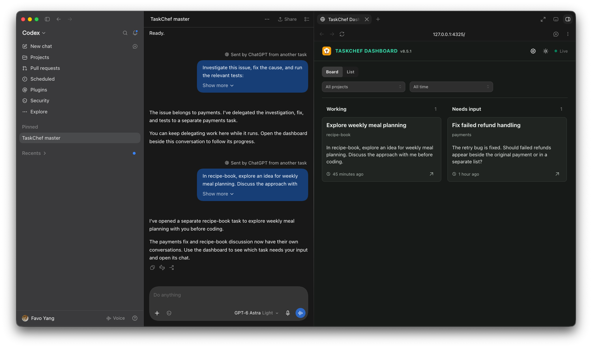
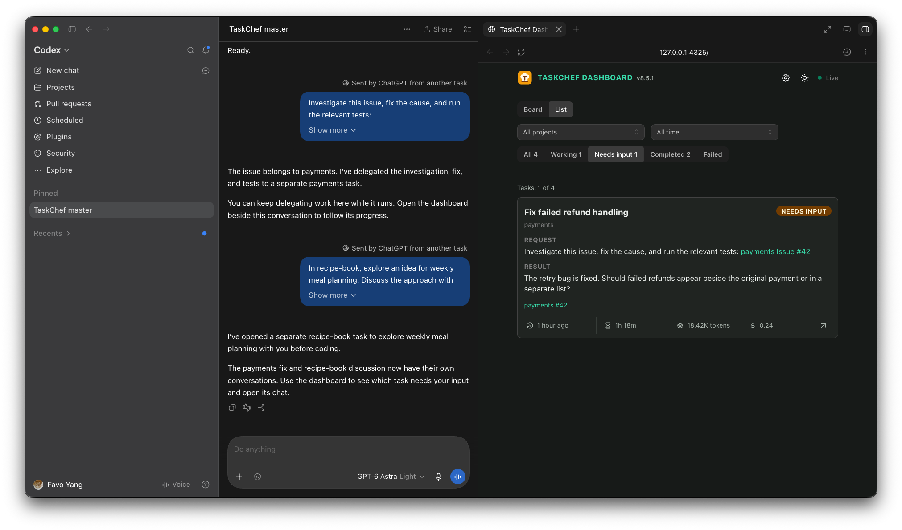
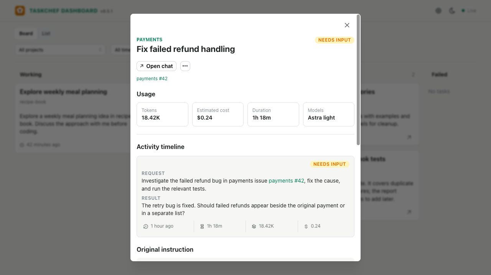
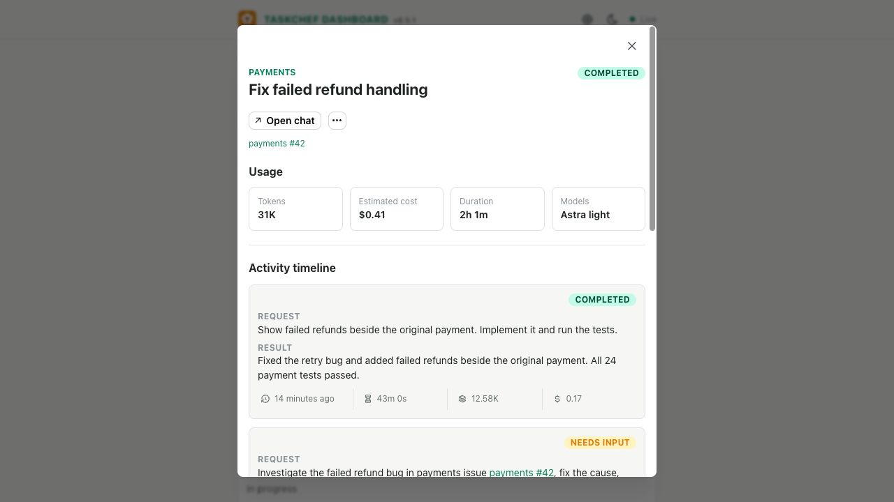
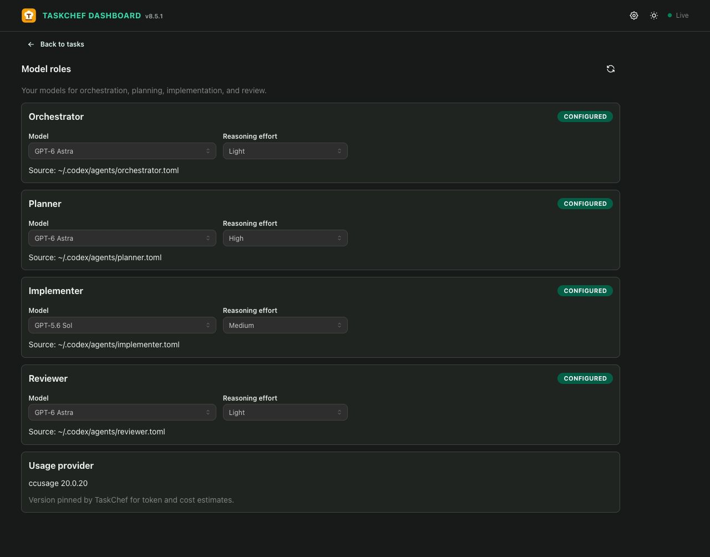

# TaskChef

**Less time managing tasks. More time moving them forward.**

When work spans several Codex projects, you have to choose the right project,
find each conversation again, and check which tasks are waiting for you.
TaskChef gives you one dispatcher conversation as a central place to talk to
agents and delegate work across projects, plus a dashboard for seeing what
needs your attention.

Give TaskChef a GitHub issue or a rough idea. It uses an explicit project name,
the conversation's context, or saved repository mappings to choose a Codex
project; if the destination is unclear, it asks you to choose. TaskChef creates
separate, ordinary Codex tasks in those projects. Each has its own conversation
and native tools, and tasks can run in parallel.

You can keep using Codex as you do today. Start by delegating work where the
project choice or follow-up is cumbersome, then bring more work into TaskChef
as you go.

## What working with TaskChef looks like

Suppose you have indexed two Codex projects, **payments** and **recipe-book**,
and saved a GitHub repository mapping for payments. In your TaskChef dispatcher
conversation, paste a payments issue link and ask:

```text
Investigate this issue, fix the cause, and run the relevant tests: https://github.com/example/payments/issues/42
```

TaskChef uses the issue URL's repository to identify the mapped payments
project. It then opens a separate Codex task there and returns its link. The
task investigates the issue in its own conversation while other delegated
tasks can work in recipe-book or other projects.

In the same dispatcher conversation, start another task from a rough idea:

```text
In recipe-book, explore an idea for weekly meal planning. Discuss the approach with me before coding.
```

TaskChef selects recipe-book by name and opens a separate task there. Discuss
the options in that task. If a written plan would help, ask it to save a
Markdown plan, then ask it to implement the agreed approach in the same task.
A plan file is created when you request one; it is not a required step for
every task.

The screenshots in this walkthrough use illustrative demo data. Open the
dashboard beside TaskChef master to see both tasks across your projects.
**Board** groups tasks by **Working**, **Needs input**, **Completed**, and
**Failed** so you can see their status at a glance.



*Board gives an overview of task status across projects.*

If the payments task needs a decision, it might ask, for example, whether to
show a failed refund beside the original payment or in a separate list. Switch
to **List** to see each task's request, latest result, and status in rows. Filter
by **Needs input** to focus on the payments task's question.



*List shows the payments request and result in the Needs input queue.*

Select the payments task and choose **Open chat** to answer in its original
Codex conversation.



*Payments task details show the question and the Open chat action.*

In that conversation, answer the question and ask the task to finish:

```text
Show failed refunds beside the original payment. Implement it and run the tests.
```

When the work finishes, its result appears on the dashboard; TaskChef does
not post each result back into the dispatcher chat.



*The completed task shows its latest result above the earlier question.*

Keep the dashboard beside your conversation in Codex's built-in browser. It
shows each task's latest request and result. Open a task to see its total
reported work duration, token usage, and estimated cost, with the same figures
for each turn in its activity timeline. Duration is reported wall-clock time
spent on turns; cost is an API-equivalent estimate, not a bill. Token and cost
figures can be unavailable when usage cannot be mapped to the Codex task.
Task states normally come from the task's own reports; TaskChef does not
automatically supervise execution.

## Install and delegate your first task

You need Node.js 18 or newer, Git, Codex desktop, and local access to the
projects that will receive work. Install the plugin:

```sh
codex plugin marketplace add favoyang/codex-plugins
codex plugin add taskchef@favoyang-plugins
```

For the first run, set up the TaskChef dispatcher and import your saved local
Codex projects:

```text
$taskchef-bootstrap Set up TaskChef and index my local Codex projects.
```

After bootstrap, choose **New chat** in Codex and select the TaskChef dispatcher
project at `~/.agents/taskchef`. We suggest renaming the new conversation
**TaskChef master**, then pinning it for easy return. Bootstrap registers and
opens the project; you create, rename, and pin the conversation yourself.
Replace `<your-project>` with one of your indexed
Codex project names and try a read-only first request:

```text
In <your-project>, explain how to run the app and tests. Do not change files.
```

TaskChef returns a link to the new Codex task. From then on, the dispatcher
checks your saved Codex projects when you delegate, so you do not need to
reindex after adding one. The local dashboard normally starts when the TaskChef
plugin activates. Open the [dashboard link](http://127.0.0.1:3210/) from the
end of each dispatcher response in Codex's side browser, beside your
conversation. If the dashboard is unavailable, ask `$taskchef-dashboard` to
ensure and open it. Use `$taskchef-bootstrap` to add repository mappings or
refine project descriptions when routing needs more context. If the installed
skills do not appear, activate or reload the TaskChef plugin in Codex and try
again.

## Choose models for each role

In the dashboard's **Settings** page, choose a model and reasoning effort for
the **Orchestrator**, **Planner**, **Implementer**, and **Reviewer** roles.
TaskChef saves these preferences in native Codex agent files under
`~/.codex/agents/` and applies them when it dispatches the corresponding work.
Set them once for future tasks; a model choice you make explicitly for a task
takes precedence over its role preference.



*Settings shows the model and reasoning effort selected for each role.*

## More detail

The [advanced guide](docs/advanced-guide.md) covers project indexing, routing,
task reporting, dashboard behavior, recovery, updates, and development. The
[specification](docs/spec.md) and [workflows](docs/workflows.md) describe the
implementation contracts. TaskChef was inspired by
[FirstMate](https://github.com/kunchenguid/firstmate); the
[comparison](docs/firstmate-taskchef-comparison.md) explains their different
approaches.
