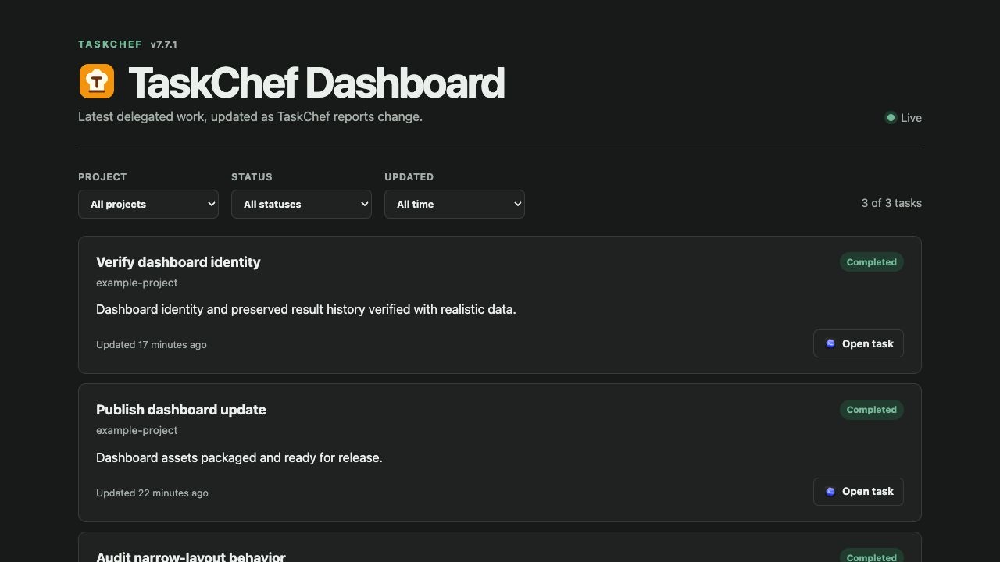
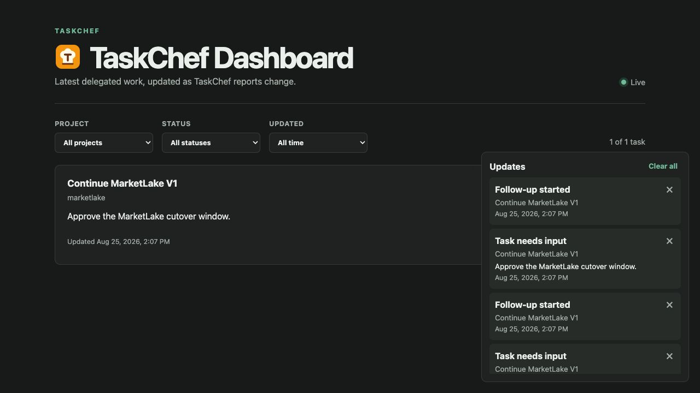
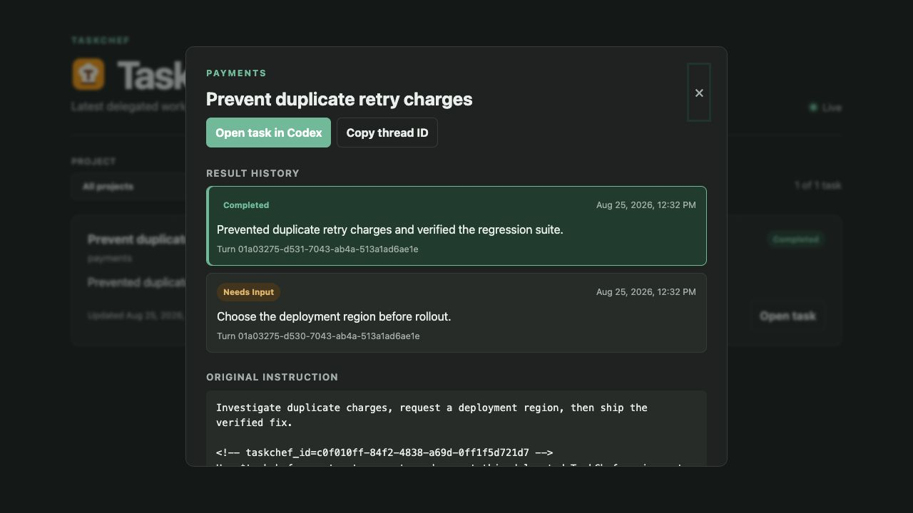
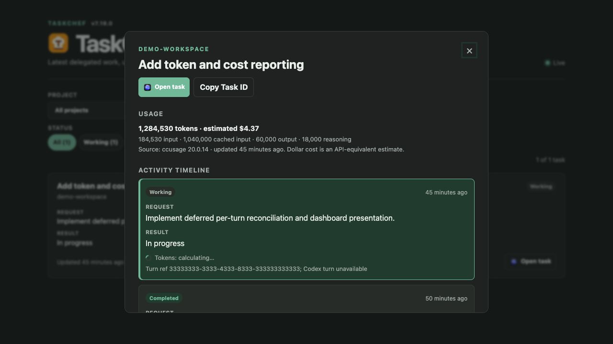
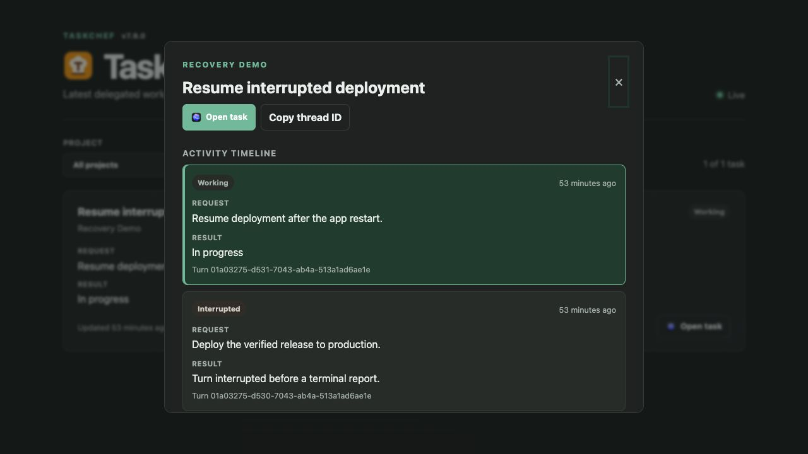

# TaskChef

TaskChef is a local dispatch desk for Codex. Give one dispatcher a request and
it records each independently useful outcome, creates a normal Codex task in
the right project, and returns immediately. The executor task is where live
work, approvals, and follow-ups happen; TaskChef pairs each turn's request with
its semantic result while projecting the latest pair for compact navigation.

```text
request -> recorded TaskChef task -> Codex executor -> request/result turn timeline
```

## Which document should I read?

| Goal | Document |
| --- | --- |
| Install, configure, dispatch, inspect, and recover | This README |
| Follow the normative agent contract and MCP interfaces | [Specification](docs/spec.md) |
| Understand implementation flows and trust boundaries | [Workflows](docs/workflows.md) |
| Compare TaskChef with FirstMate | [FirstMate comparison research](docs/firstmate-taskchef-comparison.md) |
| Review deferred ideas | [Backlog](BACKLOG.md) |

## Install

TaskChef requires Node.js 18 or newer, Git, Codex desktop, and local access to
the projects that will receive work.

Install [`ccusage`](https://github.com/ccusage/ccusage) separately when you want
the optional dashboard token and API-equivalent cost estimates. TaskChef calls
its structured offline Codex report and does not parse Codex rollout files
itself. Lifecycle reporting and the dashboard continue to work when `ccusage`
is absent or incompatible.

```sh
codex plugin marketplace add favoyang/codex-plugins
codex plugin add taskchef@favoyang-plugins
npm install --global taskchef
```

The plugin provides five skills and a local MCP server. The npm installation
puts the `taskchef` CLI on `PATH`. TaskChef installs no hooks, schedules,
daemons, login items, system services, or background identity search and needs
no elevated permissions.

## Bootstrap and index projects

Ask the bootstrap skill to create the per-user dispatcher:

```text
$taskchef-bootstrap Set up TaskChef and index my local Codex projects.
```

The canonical workspace is `~/.agents/taskchef`. TaskChef owns only:

```text
AGENTS.md       managed dispatcher instructions plus user additions
taskchef.json   schema-2 Codex project index, dashboard preference, and delegation metadata
tasks.jsonl     one task snapshot per line (schema 10; schema 4-9 migration supported)
.taskchef-usage.json   optional mode-0600 ccusage snapshot and turn-boundary cache
```

Index or inspect Codex projects conversationally:

```text
$taskchef-bootstrap List my indexed Codex projects.
$taskchef-bootstrap Index /workspace/payments as payments. It owns authorization, capture, refunds, and retries.
$taskchef-bootstrap Reindex after the Codex projects I added today.
```

TaskChef indexes existing Codex projects for delegation. The index stores
canonical paths and routing metadata; it never indexes repository contents or
creates another kind of project. For a folder already saved as a local Codex
project, the bootstrap skill requires an exact canonical-path match before
writing and verifying its TaskChef index entry. For a new folder, or an existing
folder not yet saved by Codex, it creates the directory only when explicitly
requested, opens the canonical path with the validated Codex Desktop CLI's
`codex app <path>` mechanism, re-lists native projects, and requires the same
exact match before indexing it. An open request without a verified native
project is reported as partial setup, not delegation-ready.

Reindexing catches TaskChef up with newly saved Codex projects by comparing
exact canonical paths and indexing missing requested projects. It preserves
existing curated entries and does not silently remove projects or overwrite
metadata.

Codex CLI resolution follows the same contract as
`workspace init --register-codex`: an explicit `--codex-cli` path wins, then
`TASKCHEF_CODEX_CLI`; either must be executable and support `app --help`.
Without an override, TaskChef prefers a validated `codex` PATH candidate under
`Contents/Resources`; otherwise it validates only the first executable `codex`
in PATH order. It does not assume an arbitrary shell command or hard-code an
application bundle location.

Or use the CLI:

```sh
taskchef project add /workspace/payments --name payments \
  --description "Authorization, capture, refunds, and retries."
taskchef project list
```

The CLI command writes TaskChef metadata only; it does not query Codex. Before
using it directly, verify that `/workspace/payments` exactly matches the
canonical path of an existing local Codex project. The bootstrap skill performs
that native-project check for you.

A project may advertise several GitHub repositories with repeated
`--github-repo`. Explicit values replace automatic origin detection and form
the complete advertised list, so include the origin when it should remain
routable. A managed `*-workspace` should advertise every relevant child or
subrepository canonical GitHub URL, plus the workspace repository itself when
applicable, so issue and pull-request links select the correct Codex project.
TaskChef accepts Git roots and ordinary local folders on the same execution
host. Unsupported configuration schemas are rejected and are never rewritten
automatically.

## Dispatch

Open the TaskChef dispatcher project and ask for an outcome:

```text
In payments, fix duplicate charges after a retry, add a regression test, and report what changed.
```

From another project, invoke the delegation skill explicitly:

```text
$taskchef-delegate In payments, add structured logs for failed retries and test them.
```

TaskChef prepares a UUID and marker, persists the task before native creation,
creates the executor, and returns its task link. New executor instructions keep
the assignment visible from the first line, leave one blank line, then place
an explicit `$taskchef-executor` invocation immediately before the final
correlation marker. That skill reads the executor's own `CODEX_THREAD_ID`, self-links, and
reports lifecycle state. Independent outcomes may become separate executors;
dependent work should stay together.

Activating the TaskChef MCP process best-effort ensures the dashboard by
default. The managed workspace instructions also retry it at the start of each
dispatcher turn. A startup failure never blocks MCP tools, an answer, report,
or delegation. Every dispatcher response ends with
the stable [TaskChef Dashboard](http://127.0.0.1:3210/) link; a created-task
directive remains on the preceding line so dispatch still returns immediately.

For example, TaskChef generates this shape:

```text
Fix duplicate charges after a retry and add a regression test.

Use $taskchef-executor to execute and report this delegated TaskChef assignment.
<!-- taskchef_id=c0f010ff-84f2-4838-a69d-0ff1f5d721d7 -->
```

## Work with and report executors

Open an executor as an ordinary Codex task. Each executor reports `working`
when a turn starts and one semantic outcome before that same turn ends:

- `completed`: the requested outcome is complete;
- `needs_input`: a real user decision or missing fact blocks progress;
- `failed`: the executor or creation attempt ended unsuccessfully.

A native approval prompt is live Codex state, not `needs_input`.
When work starts, the executor reports a concise request summary. TaskChef
appends a `turns` entry that pairs that request with a null result while working,
then fills the same entry with the semantic outcome. A follow-up therefore shows
its own request with “In progress,” never the preceding turn's result. Returned
tasks still derive `results` and `lastResult` as compatibility projections.
Every entry has a required `turnRef`, which is the lifecycle identity. When
Codex exposes a native turn ID, both `turnRef` and `turnId` contain that value.
Otherwise the executor retains a fresh UUID in `turnRef` and stores
`turnId: null`; native turn lookup is never a prerequisite for work or reporting.
If Codex crashes, an MCP call is lost, or the app restarts before that terminal
report, the next newer `working` report atomically marks the unfinished turn
`interrupted` and appends the new active turn. `interrupted` is TaskChef-authored
timeline evidence, not semantic `failed`, and it never enters `results` or
`lastResult`. TaskChef stores only a fixed interruption summary; it does not
store transcripts, hidden reasoning, crash output, or other non-semantic events.

Delegated tasks created by earlier TaskChef versions remain compatible: their
inline executor protocol still parses, self-links, and may use the deprecated
`report_result` alias. The v7 inline-paragraph named exports remain as deprecated
historical snapshots, but new delegations use the executor skill and `report_state`.

## View tasks and ask copilot

The dashboard is the primary monitoring and browsing UI. Ask copilot when you
want a concise explanation or recommendation:

```text
$taskchef-copilot Summarize recent delegated work and tell me what needs attention.
```

Copilot starts from TaskChef's normalized cached brief. It uses live Codex
metadata only when you explicitly request fresh/live verification or a focused
task presents a meaningful contradiction, and it never polls. It can identify
the exact executor, explain or draft a same-assignment follow-up, and—with your
explicit authorization—continue that existing task. It never automatically
retries failures, interrupts working tasks, or redelegates an executor. New
independent work still belongs to `$taskchef-delegate`. In the dispatcher, an
explicit instruction to answer, resume, or continue a named existing task
routes to copilot; it re-reads that exact task before sending.

The former `$taskchef-report` skill is not packaged as an alias because a
second discoverable skill would preserve ambiguous behavior. Explicit
historical invocations are understood as requests for `$taskchef-copilot` and
receive a brief rename notice.

File-backed inspection is also available:

```sh
taskchef task brief
taskchef task brief c0f010ff
taskchef task brief --project payments
taskchef task list
taskchef task list --project payments
taskchef task show c0f010ff
taskchef task summary
```

Add `--json` for structured output. `task brief` returns the stable schema-1
cached coordination model and omits terminal tasks older than seven days from
overviews unless `--all` is supplied. Focused task and project briefs retain
their full selected scope. Task IDs accept a full UUID or an unambiguous
eight-character prefix.

## Dashboard

Use the packaged recovery skill to make the dashboard available and open it:

```text
$taskchef-dashboard Ensure and open the TaskChef dashboard.
```

MCP activation and `$taskchef-dashboard` call the input-free `ensure_dashboard`
MCP tool. It starts at
most one dashboard inside the existing TaskChef MCP process on
`127.0.0.1:3210`, or reuses a listener only when its bounded `/api/health`
identity proves the exact TaskChef/dashboard-server version and the same
canonical workspace. The response says `started` or `reused` and includes the
stable URL, canonical workspace, and versions.

The in-process dashboard closes with the MCP process. Closing Codex or reloading
the plugin may therefore stop the dashboard; activating the next TaskChef MCP
process normally restores it. TaskChef adds no OS-persistent component.

Autostart is enabled when `dashboard` is absent and in new workspaces. To opt
out, add this optional exact object to `taskchef.json` while retaining its other
fields:

```json
"dashboard": { "autostart": false }
```

The manual `$taskchef-dashboard` recovery skill remains available when
autostart is disabled or fails. It reports whether the compatible dashboard was
started or reused and always returns its canonical clickable URL. It may open
the returned localhost URL in an available in-app browser, but browser failure
does not make dashboard recovery fail.

For manual development, run the foreground CLI:

```sh
taskchef dashboard
taskchef dashboard --port 3211
```

The loopback dashboard watches `tasks.jsonl`, groups current states, and opens
linked Codex tasks. List snapshots and SSE events carry only the latest
request/result pair; opening task details fetches the full newest-first activity
timeline, including clearly labeled interrupted turns.
Task details offer infrequent administrative actions without cluttering task
cards. The **More task actions** (`…`) menu contains **Copy Task ID** and, for a
`working` or `needs_input` task, direct **Mark completed** and **Mark failed**
actions. The menu disclosure is the deliberate first step; choosing a terminal
outcome submits it immediately without a second confirmation. There is no
free-form reason: the audit turn records a fixed summary, timestamp, dashboard
provenance, optimistic preconditions, and a unique action ID while preserving
every executor turn. Terminal tasks cannot be rewritten. Stale or concurrent
changes are rejected and the dialog refreshes to the current task.

Task details also offer **Archive chat** for every linked task whose current
TaskChef state is not `working`. After confirmation, TaskChef invokes only the
Codex CLI at the canonical ChatGPT or Codex desktop app location under
`/Applications`, to archive the exact thread UUID. The Codex chat leaves active chat lists while the TaskChef record
and its activity timeline remain unchanged. If the bundled CLI is unavailable,
the dashboard does not fall back to another `codex` executable from `PATH`.

Task details also show whole-task and per-turn token usage when `ccusage` can
map the linked Codex thread. A completed turn briefly shows “Tokens:
calculating…” while TaskChef performs bounded deferred reconciliation, because
the terminal lifecycle callback precedes Codex's final output write. Historical
tasks may show a trustworthy task total while older turns remain “Tokens
unavailable” when no cumulative turn boundaries were recorded. Input, cached
input, output, reasoning, and total counts retain ccusage's categories. Dollar
figures are labeled API-equivalent estimates; zero-priced unknown models show
cost unavailable rather than a misleading `$0.00`.
The header shows the running TaskChef package version reported by the same
bounded health identity used for compatible-listener checks.
The canonical port is owned by a dashboard initialized in the TaskChef MCP host
before its tool transport connects. Health identity records an `mcp` launcher,
and MCP recovery reuses only another exact-compatible MCP-launched dashboard;
a foreground `taskchef dashboard` process is intentionally standalone so its
child commands cannot silently inherit an agent-shell sandbox.
Task and result times are relative through 29 days (with minute detail for the
first six hours), then use a locale-aware calendar date. Each time is a keyboard-
accessible toggle for its full locale-aware date and time, and one shared
30-second timer keeps relative labels current without reloading the page.
The Updates panel captures immutable event-time lifecycle notices. It identifies
them by task, turn when available, and lifecycle event rather than dashboard
revision, so reconnects and non-semantic rewrites do not replay a notice and a
later task state cannot rewrite an older notice. A notice remains readable if
its task disappears; selecting it then explains that current details are no
longer available.
Apart from an explicit manual state selection from the task-detail menu, it does not mutate
TaskChef data and prints its local URL. A foreground dashboard identifies
itself as standalone and is never reused on the canonical MCP port. If a
standalone, unknown, different-workspace, or stale-version process owns port
3210, TaskChef reports a concise conflict and never kills or replaces that
process. The foreground CLI similarly asks you to stop the listener or choose
another `--port`.

The health endpoint contains only a fixed service marker, health schema,
TaskChef version, dashboard-server version, canonical workspace, and launcher.
It exposes no task data, credentials, environment variables, process control,
or secrets.











## Common recovery

Check the managed workspace:

```sh
taskchef doctor
taskchef workspace init
taskchef workspace migrate
taskchef doctor
```

`doctor` is read-only. `workspace init` creates missing files and refreshes
managed instructions. `workspace migrate` explicitly upgrades supported schema
4-9 task lines to schema 10 under the workspace lock. It validates task and turn
counts plus the complete source and converted log before writing, creates an
exclusive `tasks.jsonl.pre-v10-*.bak`
backup, atomically replaces the log, validates the result, and becomes an
idempotent no-op after migration. If replacement fails, the original remains
or the reported backup can be restored; unsupported or invalid input is rejected
before a backup or rewrite.

If a new record has no thread ID, the executor is link-pending. Reopen that
executor so its first action can retry `link_task`. Do not guess an identity
or edit `tasks.jsonl`. If native task creation failed, the record is retained
as `failed` with a retained fallback `turnRef` and null thread and Codex turn IDs.

Schemas other than 4, 5, 6, 7, 8, 9, and 10 remain unsupported. Retain such a workspace
unchanged and create a current workspace; the migration command deliberately
does not guess how to convert unknown formats.

## Boundaries

TaskChef dispatches; it is not a scheduler, supervisor, worker runtime, or
merge coordinator. Executor identity is a cooperative assertion inside a local
single-user trust boundary. The [specification](docs/spec.md) defines the
required contract; [workflows](docs/workflows.md) ties it to current code.

## Update

```sh
codex plugin marketplace upgrade favoyang-plugins
codex plugin add taskchef@favoyang-plugins
```

Replacing or installing plugin files cannot execute autostart by itself. After
installation, activate or reload the new TaskChef MCP process; installation
does not necessarily reload Codex. Then run `$taskchef-dashboard` (or call
`ensure_dashboard`) and verify the returned dashboard identity has all of:

- the expected released TaskChef version;
- the expected dashboard protocol `serverVersion`;
- the `mcp` dashboard launcher;
- the canonical TaskChef workspace path;
- the canonical `http://127.0.0.1:3210/` URL.

The release-install sequence is therefore: install plugin, activate or reload
the new MCP process, ensure the dashboard, then verify TaskChef version,
protocol `serverVersion`, `mcp` launcher, canonical workspace, and URL.
Exact-compatible MCP servers may be reused; standalone and unknown listeners
remain untouched.

## Development

```sh
npm ci
npm test
npm pack --dry-run
```

Merges to `main` run semantic-release and update the shared plugin
marketplace. Removing unsupported schemas is a major-version change.
