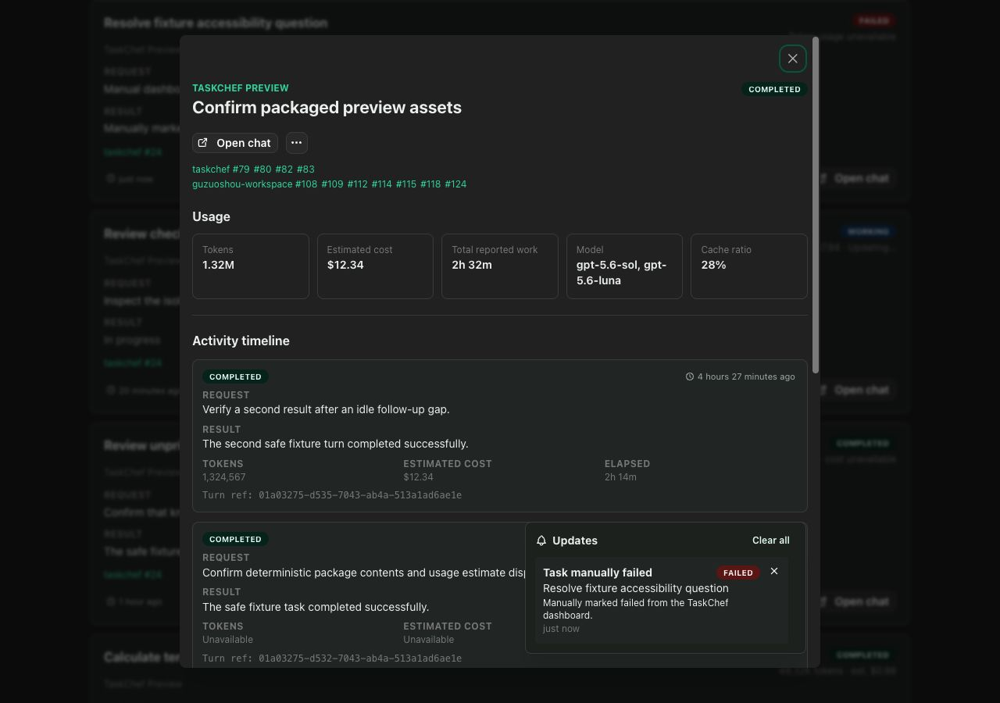
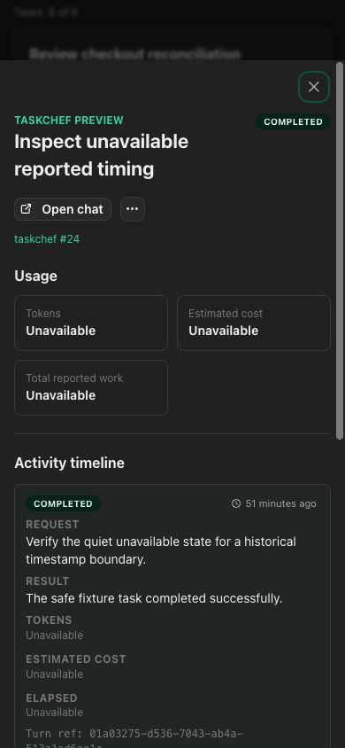

# Dashboard lifecycle

This document defines how the canonical TaskChef dashboard starts, survives MCP
reloads, changes version, and stops. The [specification](spec.md) is normative;
the [README](../README.md) covers user operation, and
[workflows](workflows.md) maps these guarantees to implementation.

## Ownership model

The canonical dashboard is a loopback-only process scoped to a running Codex
application session. It is launched and maintained by TaskChef MCP activation,
but it is not hosted by one MCP transport. This distinction lets the dashboard
survive an individual MCP EOF, signal, transport close, or plugin reload while
other TaskChef MCP transports in the same Codex session continue using it.

TaskChef does not install a daemon, login item, lifecycle hook, or privileged
service. A foreground `taskchef dashboard` process remains a separate
`standalone` launcher and is never adopted as the canonical session dashboard.

The dashboard was originally moved into the MCP runtime so the experimental
chat-archive action could inherit the MCP host environment. That action is now
disabled because Codex does not expose a reliable supported app-callable
archive interface. The dashboard still benefits from MCP activation,
workspace resolution, and startup isolation, but none of those requires the
HTTP listener to share one MCP transport's lifetime. The session process keeps
those benefits without retaining the obsolete per-transport ownership.

## Token usage presentation

The detail view distinguishes an active turn whose final usage is pending from
a terminal turn whose usage is being calculated. Available usage keeps both
the token total and API-equivalent USD estimate. Task cards keep the latest
cumulative value visible during a newer active turn and label it as updating;
pending is reserved for tasks that do not have a usage snapshot yet.

## Reported work presentation

The task detail view reports wall-clock elapsed time from TaskChef lifecycle
timestamps. Each terminal turn's **Elapsed** value is `result.updatedAt` minus
`startedAt`. **Total reported work** is the sum of valid terminal-turn elapsed
times, so idle gaps between follow-up turns and the unfinished portion of an
active turn are excluded. A working turn shows a live **Elapsed so far** value
from `startedAt` to the current time without adding it to the task total.

Durations below one minute use whole seconds; durations below one hour use
minutes and seconds; durations below one day use hours and minutes; longer
durations use days and hours. Each displayed unit is floored, and positive
sub-second durations display as `<1s`. Missing, malformed, reversed, or
unsupported timestamp ranges display an explicit unavailable state. Zero-width
terminal ranges are also unavailable because existing records cannot reliably
distinguish synthesized boundaries from same-millisecond measured work. Timing
is derived independently of `.taskchef-usage.json` and is reported wall-clock
elapsed time, not model compute time.

## Start and reuse

Unless `dashboard.autostart` is explicitly `false`, MCP activation runs the
same serialized ensure operation exposed by `ensure_dashboard` before the MCP
transport connects. An explicit ensure remains available when autostart is
disabled. Failure is isolated from MCP tool startup and emits only a bounded,
non-sensitive diagnostic.

The canonical session manager requires an explicit nonzero port and normally
binds `127.0.0.1:3210`; ephemeral port zero remains available only to direct
foreground/server callers that own the returned listener. Reuse requires an
exact bounded health identity:

- TaskChef dashboard service and health schema;
- installed TaskChef version;
- dashboard protocol version;
- canonical workspace;
- `session` launcher.

The MCP then authenticates the listener with the private ownership credential
and registers its original Codex parent PID as a session lease. Registration
success and transferred lease sets carry response HMACs bound to their fresh
request nonce and complete result, so a different process appearing between
the challenge and control request cannot be adopted. Concurrent starts
serialize locally and converge across processes by authenticating the single
listener that wins the port race.

A detached child reports readiness over a private inherited IPC channel only
after the listener is bound and the new owner record is durably published.
Startup errors use the same channel. A bounded timeout sends a cooperative
cancellation message, so slow or failed initialization cannot be mistaken for
success or silently strand a late or partially constructed listener. Owner
publication checks cancellation before atomic replacement; while publication
is in flight, every close path retains the port until publication settles, so
an older credential writer cannot race and overwrite a succeeding session's
owner record.

## MCP reload and plugin upgrade

Closing one MCP transport does not close the session dashboard. EOF, SIGINT,
SIGTERM, protocol close, failed transport startup, and detected MCP-parent loss
still close that MCP process promptly, but the independently hosted dashboard
remains while a registered Codex session PID is alive.

After a plugin upgrade, installing files alone cannot execute new code. When
the newly installed MCP activates, it compares the live identity with its own
version. An exact current listener is reused. A verified older TaskChef
`mcp`- or `session`-launched listener for the same canonical workspace receives
an authenticated graceful handoff request. A session listener prepares an
idempotent handoff by fencing new registrations, adding the activating Codex
PID, and snapshotting its bounded live leases while it remains running. Only
after the MCP receives and verifies that signed result does it send a separate
authenticated commit that schedules graceful shutdown. A lost prepare response
is safely retried; an abandoned preparation expires and reopens registration.
A commit begins a short bounded finalization grace during which concurrent
authenticated activators can join. The commit response then returns the final
immutable lease snapshot with a credential-bound proof. The listener remains
available for a bounded commit-response retry window before graceful shutdown,
so a surviving activator can replace an elected peer that exits before launch
without discarding the older live sessions. The replacement starts with the
verified final leases. A full lease set refuses a distinct activating PID
without stopping the old listener. Finalization also reserves one of the 64
bounded lease slots for a distinct recovery activator; a 64-lease snapshot
cannot commit retirement and leaves the old listener running. The new MCP then
starts the current `session` version. A newer listener is never downgraded,
including during the brief old-to-new listener gap. If different newer versions
race, a higher contender authenticates and replaces a lower winner until the
highest active version remains.

Before acknowledging commit, the retiring session atomically records that
signed final snapshot in the mode-`0600` workspace file
`.taskchef-dashboard-handoff.json`. The record
contains no control secret. It exists only so an activator that loses every
commit response can authenticate and recover the exact finalized leases after
the old listener closes. The single record is retained and atomically
overwritten by the next finalized handoff; it cannot authenticate against a
new owner identity and secret. Avoiding post-publication deletion prevents one
replacement from removing a newer handoff generation. Invalid, permissively
readable, foreign-workspace, or incorrectly signed records are ignored and
never authorize takeover.

Both private metadata writers sync the completed file, atomically rename it,
and sync the canonical workspace directory before reporting publication. Final
lease joins are fenced before the immutable snapshot and durable write begin.

Versions predating authenticated ownership cannot be retired safely. Such a
legacy listener may require one final manual cleanup. This limitation is
intentional; TaskChef does not weaken listener safety to automate migration.

## Codex session end

Each MCP registers the exact PID of the Codex process that launched it. The
dashboard checks only those registered PIDs with a non-signalling existence
probe. When none remains alive for the configured grace period, the dashboard
gracefully closes its HTTP listener and exits. Registering another live Codex
session during the grace period cancels expiry.

This is a best-effort local lifecycle guard, not a claim that Codex documents
or guarantees restart cleanup. PID existence cannot prove application identity
after an unlikely PID reuse, and abrupt operating-system termination can always
interrupt graceful cleanup. A later MCP activation still performs authenticated
version handoff, which is the recovery boundary for a recognized stale
TaskChef listener.

## Security boundary

TaskChef writes ownership to `.taskchef-dashboard-owner.json` and finalized
handoff metadata to `.taskchef-dashboard-handoff.json` as private regular
mode-0600 files in the canonical workspace. The credential never appears in health responses,
diagnostics, URLs, or logs. A fresh nonce-bound HMAC challenge proves that the
listener and owner record share the credential. Shutdown and session
registration use separate action-bound proofs; successful registration and
handoff responses are also nonce- and result-bound. Nonces are single-use within
a bounded five-minute replay window. The replay cache has a fixed capacity and
refuses overflow while entries remain valid.

TaskChef sends control requests only after all public identity and private
ownership fields match. It never discovers or kills a port owner, sends OS
signals to a listener, uses `kill -9`, searches broadly for processes, or
requires elevated permission. These listeners remain untouched:

- standalone dashboards;
- unknown or spoofed services;
- different canonical workspaces;
- newer TaskChef versions;
- malformed or mismatched ownership records;
- listeners that fail the authenticated challenge;
- uncooperative legacy listeners without the handoff protocol.

## Lifecycle matrix

| Event | MCP transport | Canonical dashboard |
| --- | --- | --- |
| MCP activation, no listener | Starts | Starts current session version |
| MCP activation, exact listener | Starts | Authenticated reuse and lease registration |
| One MCP EOF, signal, or reload | Closes | Remains while a Codex session PID is alive |
| Plugin upgrade activates newer MCP | Starts current version | Verified older version retires; current version starts |
| All registered Codex session PIDs disappear | May already be closed | Graceful close after the grace period |
| `dashboard.autostart: false` | Starts normally | No activation-time ensure; explicit ensure still works |
| Foreground `taskchef dashboard` | Unrelated | Standalone process follows its foreground CLI lifetime |
| Unknown or unverified port occupant | Starts normally | Occupant is untouched; ensure reports a bounded conflict |
