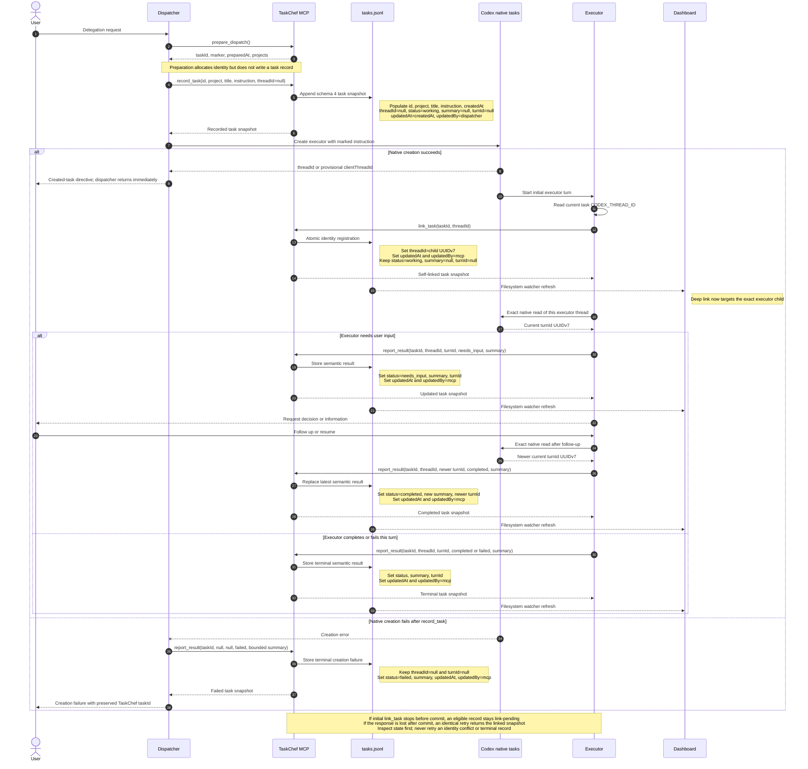

# Delegation and result design

TaskChef stores a durable local task history while Codex owns execution. The
dispatcher records intent, the executor registers its own identity, and only
the executor reports semantic outcomes.

## Lifecycle

### Invocation sequence

Read the diagram from top to bottom. Solid calls into **TaskChef MCP** name the
MCP function being invoked. Notes beside `tasks.jsonl` show the fields written
by that step. Native Codex task creation and exact thread reads are deliberately
separate because they are not TaskChef MCP calls.

### MCP calls and field transitions

| Step | Caller | Operation | Key input | Task record effect |
| --- | --- | --- | --- | --- |
| 1 | Dispatcher | `prepare_dispatch` | No task identity supplied | Returns `taskId`, exact `marker`, `preparedAt`, and configured `projects`; does not write `tasks.jsonl`. |
| 2 | Dispatcher | `record_task` | `id`, `project`, `title`, marked `instruction`, `threadId: null` | Appends schema 4 with `createdAt`; sets `status: working`, `summary: null`, `turnId: null`, `updatedAt: createdAt`, `updatedBy: dispatcher`. |
| 3 | Dispatcher | Native Codex task creation—not MCP | Target project plus marked instruction | Does not change the TaskChef record. A returned durable or provisional ID is not identity authority. |
| 4 | Executor | `link_task` | Marked `taskId` plus its own `CODEX_THREAD_ID` | Atomically changes `threadId` from `null` to the canonical child UUIDv7; refreshes `updatedAt` and sets `updatedBy: mcp`. |
| 5 | Executor | `report_result` | Exact `taskId`, self-linked `threadId`, current `turnId`, semantic `status`, concise `summary` | Replaces the latest `status`, `summary`, and `turnId`; refreshes `updatedAt` and sets `updatedBy: mcp`. Changed follow-up results require a newer UUIDv7 `turnId`. |
| Failure | Dispatcher | `report_result` after native creation error | `taskId`, `threadId: null`, `turnId: null`, `status: failed`, bounded `summary` | Preserves the pre-created record and null identity while storing a terminal creation failure. |

### Lifecycle rules

1. `prepare_dispatch` returns a fresh task UUID, exact marker, timestamp, and
   configured projects.
2. The dispatcher calls `record_task` with the complete marked instruction and
   `threadId: null` before native creation.
3. The dispatcher creates the Codex task and returns immediately. A durable or
   provisional creation result is never treated as authority to link the
   record.
4. As its first TaskChef action, the executor reads its own durable native
   thread ID and calls `link_task(taskId, threadId)`.
5. Before ending a turn with a semantic outcome, the executor reads that exact
   thread, takes the current turn ID, and calls `report_result`.

There is no task listing, candidate read, marker search, wait, retry loop,
transcript read, or hook in the dispatch path. The existing filesystem watcher
notices the atomic `link_task` rewrite and immediately refreshes the dashboard.

## Identity guarantees

The exact marker correlates the child instruction with the pre-created record.
The executor must use its native current thread ID, never the delegation
`sourceThreadId`, parent task, inherited session identity, title, or provisional
client ID.

`link_task` runs under the workspace lock. It permits one atomic
`null`-to-durable transition, rejects malformed or provisional IDs, rejects a
thread already owned by another TaskChef task, rejects a different retry, and
returns the existing snapshot for an identical retry.

Custom MCP does not currently authenticate the calling Codex task. The thread
ID is therefore a cooperative assertion inside TaskChef's local single-user
trust boundary. The design prevents accidental parent/child confusion but does
not claim resistance to a deliberately forged local MCP call.

## Failure and retry behavior

If native creation fails after recording, the dispatcher writes one terminal
`failed` result with null thread and turn IDs and a bounded summary. If an
otherwise eligible executor is interrupted, cancelled, or cannot see
`link_task` before the initial atomic write commits, the record remains
`working` with `threadId: null`. That visible link-pending state is retryable on
a later turn. If the write commits but its response is lost, the record is
already linked and an identical retry idempotently returns the linked snapshot.
A rejected link must be inspected: only an unchanged, eligible link-pending
record should be retried. Identity conflicts preserve an existing durable link,
and terminal creation failures remain `failed`; neither should be blindly
retried. TaskChef never guesses or recovers identity through the dashboard.

## Result freshness

Linked results require an exact thread-ID match and a non-null current turn ID.
For self-linked schema 4 journeys, the native time-ordered Codex UUID must be
strictly newer for every changed result; exact same-turn retries remain safe.
Identical `report_result` retries are safe. A follow-up or resumed executor must
read its exact task again and report the new turn ID; reusing the initial turn
cannot establish freshness.

The latest snapshot fields are `status`, bounded `summary`, `turnId`,
`updatedAt`, and `updatedBy`. Historical `updatedBy: hook` values remain
readable, but new installations contain no hook and new writes use `dispatcher`
or `mcp`.

## Legacy recovery

`taskchef task resolve` is retained only for unresolved schema 1-3 records.
Operators must establish one exact marker match and one unique durable child
ID. Schema 4 self-linking records reject manual resolution. History is read
compatibly and is not eagerly rewritten.

## Dashboard and reports

The dashboard deep link uses only the stored self-linked child ID. File watcher
events surface linking and results without user interaction. Reporting may
compare current native metadata with cached semantic results, but it never
writes inferred lifecycle state.
