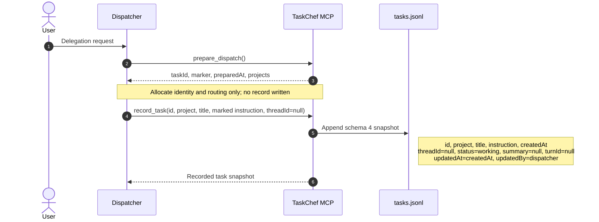
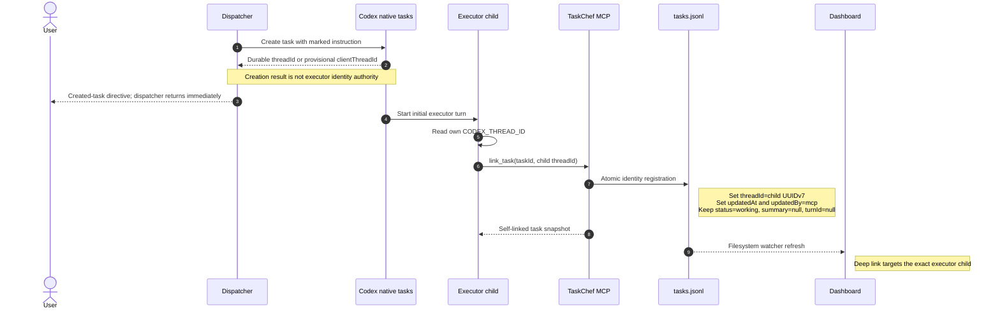
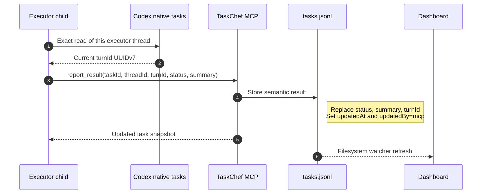
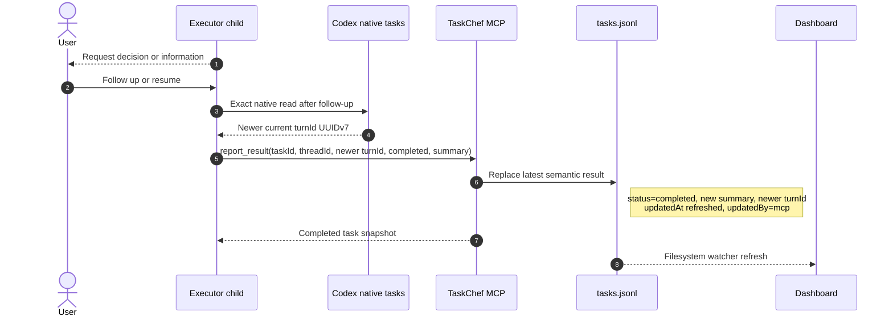
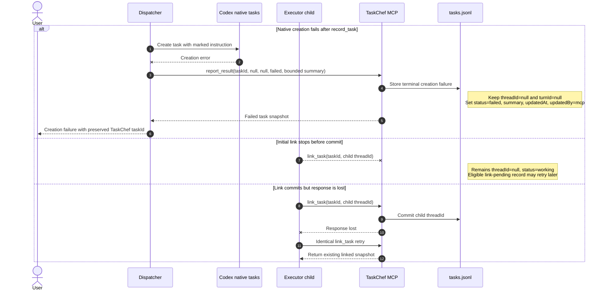
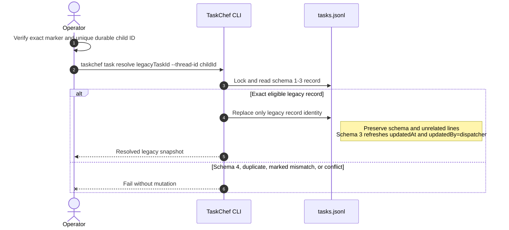
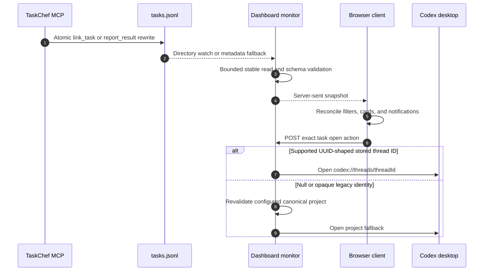

# Delegation and result design

TaskChef stores a durable local task history while Codex owns execution. The
dispatcher records intent, the executor registers its own identity, and only
the executor reports semantic outcomes.

This developer and advanced-agent workflow describes TaskChef 6.x. The
[specification](../SPEC.md) owns required behavior and terminology; this
document explains how the current code implements that contract. Start with the
[README](../README.md) for normal use. The
[FirstMate comparison](firstmate-taskchef-comparison.md) is separate,
non-normative research.

## Implementation surfaces

| Surface | Current responsibility |
| --- | --- |
| `skills/taskchef-delegate/SKILL.md` | Agent routing, exact executor instruction scaffold, record-before-create, one native creation call, and immediate return. |
| `src/mcp.js` and `mcp/server.js` | Zod-validated `prepare_dispatch`, `record_task`, `link_task`, and `report_result` MCP contracts over stdio. |
| `src/delegation.js` | Marker parsing, canonical Codex UUIDv7 validation, executor paragraphs, and the library-level create-and-record helper. |
| `src/workspace.js` | Project and task schemas, shared lock, atomic JSONL writes, self-linking, result freshness, and legacy resolution. |
| `src/cli.js` | Workspace/project administration, data inspection, diagnostics, dashboard startup, and CLI-only legacy recovery. |
| `skills/taskchef-report/SKILL.md` | Bounded live-report policy over cached results and native Codex metadata. |
| `src/dashboard.js` and `src/dashboard/*` | Loopback server, bounded log monitor, server-sent updates, filtering, notifications, and open-in-Codex actions. |

## Identity vocabulary used in the diagrams

The central identity rule is: **the executor child links itself**. The
dispatcher may create the child, but it never treats its own thread, a parent
thread, or a provisional creation handle as the executor's durable identity.

| Term | Meaning |
| --- | --- |
| TaskChef task ID | Stable UUID allocated by `prepare_dispatch`; it identifies the durable TaskChef record. |
| Exact marker | First-line correlation marker copied into the executor instruction; it binds that instruction to the pre-recorded TaskChef task. |
| Source or parent thread ID | The dispatcher/delegator context; never valid as the executor identity. |
| Executor thread ID | The child's own durable `CODEX_THREAD_ID`; the executor supplies it to `link_task`. |
| Provisional client thread ID | Temporary native creation handle; useful for creation UI, but never identity authority. |
| Turn ID | Current native turn UUIDv7 read from the exact executor thread; it proves result freshness. |
| `tasks.jsonl` | Durable append/rewrite history whose latest snapshot is shown by TaskChef. |

The complete normative glossary is in [SPEC.md](../SPEC.md#terminology). The
diagrams below are intentionally small. Calls into **TaskChef MCP** name
the MCP function being invoked. Notes beside `tasks.jsonl` name the fields that
step populates or replaces.

## Workflow 1: Prepare and record intent

The dispatcher first asks TaskChef to allocate routing and correlation values.
`prepare_dispatch` does not write a record. The dispatcher then embeds the exact
marker in the instruction and calls `record_task` **before** native creation, so
an executor can self-link as soon as its first turn starts.

## Workflow 2: Create and self-link the executor

After recording, the dispatcher creates the native Codex task and returns
immediately. A durable or provisional ID returned to the dispatcher is not
trusted as executor identity. The child reads its own `CODEX_THREAD_ID` and
uses `link_task` as its first TaskChef action.

The exact marker correlates the child instruction with the pre-created record.
`link_task` atomically permits one `null`-to-durable transition, rejects a
malformed or reused ID, and makes the dashboard deep link target the child—not
the source, parent, or dispatcher thread.

## Workflow 3: Report the current turn

Before ending with a semantic outcome, the executor reads its exact native
thread and obtains that turn's current UUIDv7. It then calls `report_result`
with its matching self-linked thread ID. The status is `completed`, `failed`,
or `needs_input`; the summary is concise and bounded.

Changed results must use a strictly newer turn ID. An identical same-turn retry
is idempotent, but reusing an old turn ID for a changed result cannot establish
freshness.

## Workflow 4: Resume after `needs_input`

`needs_input` is a semantic pause, not a native approval prompt. After the user
responds or resumes the task, the executor reads the exact task again. The new
turn ID, rather than the initial one, accompanies the updated result.

## Workflow 5: Creation and linking failures

Because `record_task` happens first, native creation failure remains visible:
the dispatcher reports one terminal failure while both identity fields stay
null. The dispatcher makes exactly one native creation call and never retries
it. TaskChef never guesses an executor identity from recent tasks, titles,
transcripts, or dashboard activity.

For linking, outcome depends on where interruption occurs. Before commit, an
eligible record remains link-pending. If the atomic write commits but its reply
is lost, the record is already linked and an identical retry returns that
snapshot. Inspect rejections before retrying; identity conflicts and terminal
records must not be blindly retried.

## MCP calls and field transitions

| Step | Caller | Operation | Key input | Task record effect |
| --- | --- | --- | --- | --- |
| 1 | Dispatcher | `prepare_dispatch` | No task identity supplied | Returns `taskId`, exact `marker`, `preparedAt`, and configured `projects`; does not write `tasks.jsonl`. |
| 2 | Dispatcher | `record_task` | `id`, `project`, `title`, marked `instruction`, `threadId: null` | Appends schema 4 with `createdAt`; sets `status: working`, `summary: null`, `turnId: null`, `updatedAt: createdAt`, `updatedBy: dispatcher`. |
| 3 | Dispatcher | Native Codex task creation—not MCP | Target project plus marked instruction | Does not change the TaskChef record. A returned durable or provisional ID is not identity authority. |
| 4 | Executor | `link_task` | Marked `taskId` plus its own `CODEX_THREAD_ID` | Atomically changes `threadId` from `null` to the canonical child UUIDv7; refreshes `updatedAt` and sets `updatedBy: mcp`. |
| 5 | Executor | `report_result` | Exact `taskId`, self-linked `threadId`, current `turnId`, semantic `status`, concise `summary` | Replaces the latest `status`, `summary`, and `turnId`; refreshes `updatedAt` and sets `updatedBy: mcp`. Changed follow-up results require a newer UUIDv7 `turnId`. |
| Failure | Dispatcher | `report_result` after native creation error | `taskId`, `threadId: null`, `turnId: null`, `status: failed`, bounded `summary` | Preserves the pre-created record and null identity while storing a terminal creation failure. |

## Concurrency and persistence

Configuration and task-history mutation APIs enter `withWorkspaceLock` in
`src/workspace.js`, backed by `proper-lockfile` on the dispatcher workspace.
`initializeWorkspace` creates and permissions the directory first, then locks
before writing managed file content. The exported `ensureWorkspaceInstructions`
and `ensureWorkspaceSkills` compatibility helpers do not lock themselves and
must not be called concurrently. New records are appended through an atomic
whole-file replacement; identity and result updates replace exactly one JSONL
line while retaining the others. Validation occurs again inside the lock, so
concurrent dispatchers cannot reuse a task ID and concurrent executors cannot
claim the same canonical Codex UUID. An abandoned lock is recoverable;
permanent permission errors fail immediately.

The task log is a snapshot collection, not an event log. `record_task` writes
the initial state, `link_task` replaces identity state, and `report_result`
replaces semantic state. `updatedAt` and `updatedBy` identify the latest
persisted writer but do not describe every transition.

## Trust and writer boundaries

There is no task listing, candidate read, marker search, wait, polling loop,
native creation retry, transcript read, or hook in the dispatch path. The
filesystem watcher notices atomic TaskChef writes and refreshes only the
dashboard; reports read current state on demand.

Custom MCP does not authenticate the calling Codex task. The executor thread ID
is therefore a cooperative assertion inside TaskChef's local single-user trust
boundary. The design prevents accidental parent/child confusion but does not
claim resistance to a deliberately forged local MCP call.

The dashboard has a separate trust boundary. It binds to loopback, exposes the
task history without browser authentication, and gates its open-in-Codex POST
with exact Host and Origin checks. It never becomes an MCP caller or a task-log
writer.

Historical `updatedBy: hook` values remain readable, but new installations
contain no hook and new writes use `dispatcher` or `mcp`. The 6.x runtime has
no lifecycle hook, initial-prompt identity polling, recent-thread marker search,
or dispatcher-side link repair.

## Legacy recovery

`taskchef task resolve` is retained only for unresolved schema 1-3 records.
Operators must establish one exact marker match and one unique durable child
ID. Schema 4 self-linking records reject manual resolution. History is read
compatibly and is not eagerly rewritten.

## Dashboard and reports

The dashboard monitor opens one descriptor for a bounded read, uses
`O_NOFOLLOW` on platforms that expose it, enforces file/task/display bounds,
and verifies that the descriptor stayed stable before publishing a snapshot. A
directory watcher catches TaskChef's atomic replacement; a
low-frequency stat check recovers from missed watcher events. Invalid or racing
reads leave the last valid snapshot visible. Server-sent events notify all
bounded clients, and slow clients keep at most one queued snapshot.

The report skill is not part of this watcher flow. It reads TaskChef snapshots
on demand, takes one bounded native metadata snapshot, and may perform one
targeted exact-thread read when freshness is uncertain. It never writes
inferred lifecycle state. The dashboard does not query native metadata, submit
replies, or refresh semantic results.

Direct navigation checks the stored ID's supported Codex UUID shape; it does
not prove that a historical record passed the schema 4 self-link transition.
This keeps UUID-shaped legacy records directly openable, while null or opaque
legacy identities take the revalidated project fallback.
