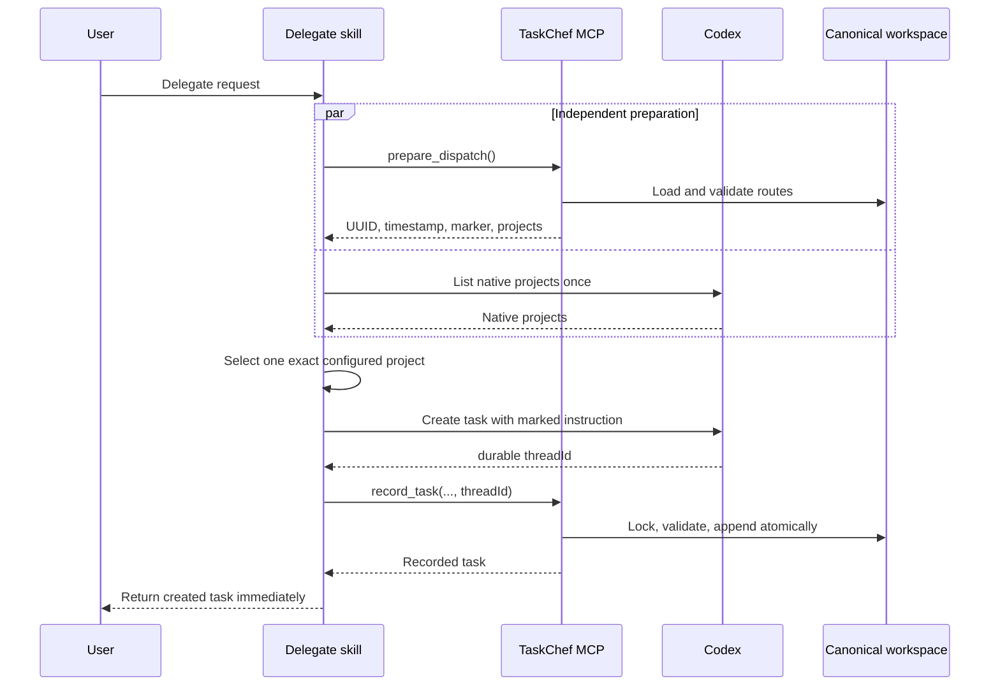
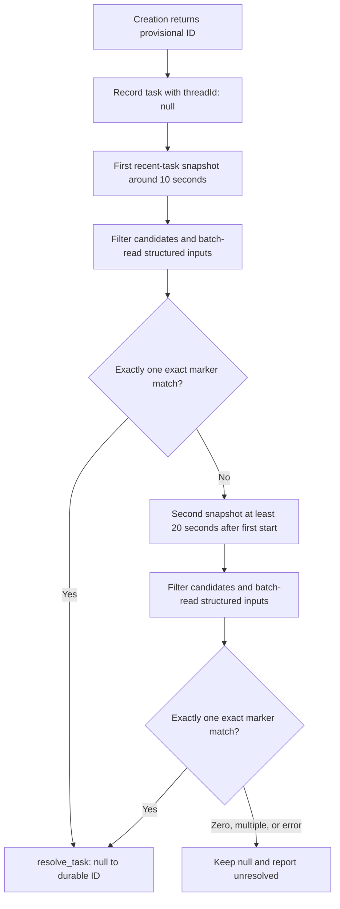

# Delegation design

This document explains how TaskChef 5.5 delegates a request, records the new
Codex task, and safely recovers a durable task ID when creation initially
returns only a provisional ID.

## Mental model

TaskChef is the dispatcher and Codex tasks are the executors. TaskChef chooses
where work belongs, creates a normal Codex task there, and appends one entry to
the canonical `~/.agents/taskchef/tasks.jsonl` history. It returns after the
task is recorded; it does not wait for executor completion.


Three focused local tools handle TaskChef-owned data operations:

| Tool | Responsibility | Mutates history? |
| --- | --- | --- |
| `prepare_dispatch` | Load routes and generate the UUID, timestamp, and exact marker | No |
| `record_task` | Append the created task with a durable ID or `null` | Yes, one atomic append |
| `resolve_task` | Fill a recorded `null` ID after one exact marker match | Yes, one-way and atomic |

The tools never create Codex tasks. Task creation and thread discovery remain
native Codex operations.

## Before and after structured tools

The following values come from separate real traces. The MCP record calls used
an existing record and therefore measured duplicate validation, locking, tool
transport, and permission overhead rather than a new append. The resolve calls
were idempotent. Treat the operation comparison as strong evidence about
orchestration overhead, not as a complete post-release delegation benchmark.

| Stage | Earlier CLI path | TaskChef 5.5 MCP path | What changed |
| --- | ---: | ---: | --- |
| Prepare routing data and correlation values | Several operations; roughly 0.4–1.0 s in the original trace | `prepare_dispatch`: 79 ms | One call now loads routes and generates UUID, timestamp, and marker internally |
| Native Codex project list | About 0.6–0.7 s | Still about 0.6–0.7 s | Runs concurrently with preparation |
| Create Codex task | About 0.3 s | Fundamentally unchanged | Still a native Codex operation |
| Record permission-aware operation | 7.167 s | 62 ms, then 58 ms | Removed shell, stdin, temporary-file, sandbox-failure, and approval paths |
| Resolve permission-aware operation | 8.982 s | 11 ms, then 8 ms | Uses a structured atomic call instead of a new shell command |
| Approval prompts | Required in the failing trace | None in the MCP benchmark | The installed local tool process has the appropriate tool authorization |

Combining measurements from different runs suggests a durable fast path near
1.0–1.2 seconds, compared with roughly 8–9 seconds for the later CLI benchmark.
This is an estimate until another full post-release delegation benchmark
measures every stage in one run.

### Where the time was saved

MCP is not inherently thousands of times faster than invoking a CLI. Both
paths ultimately call the same TaskChef validation, lock, and atomic-write
code. The large difference came from work surrounding that code:

| Removed overhead | Evidence from the original trace |
| --- | --- |
| Interactive stdin and EOF handling | The first TTY attempt consumed several tool round trips and did not terminate cleanly |
| Temporary-file/redirection orchestration | A second invocation was needed to pass one exact JSON value non-interactively |
| Late sandbox failure | The redirected attempt waited about 7.3 seconds before `EPERM` on the canonical workspace lock |
| Approval and retry | The escalated retry took about 11 seconds including review and then succeeded |
| Separate UUID/timestamp shell work | Those values are now generated inside `prepare_dispatch` |
| Repeated process/tool boundaries | Preparation and both writes are focused structured calls with validated schemas |

The actual TaskChef write is small. The MCP benchmark reached duplicate-record
validation in tens of milliseconds. The improvement comes mainly from avoiding
a known-to-fail sandboxed command followed by an approved retry, not from
weakening locking, atomicity, or validation.

## Durable-ID fast path



### Example

Preparation returns:

```json
{
  "schemaVersion": 1,
  "workspace": "/home/example/.agents/taskchef",
  "taskId": "c0f010ff-84f2-4838-a69d-0ff1f5d721d7",
  "preparedAt": "2026-08-14T09:30:00.000Z",
  "marker": "<!-- taskchef_id=c0f010ff-84f2-4838-a69d-0ff1f5d721d7 -->",
  "projectCount": 1,
  "projects": [
    {
      "name": "t2",
      "path": "/projects/t2",
      "isGitRepository": true,
      "githubRepos": [],
      "description": "Small Python fixture project"
    }
  ]
}
```

The exact executor instruction becomes:

```text
<!-- taskchef_id=c0f010ff-84f2-4838-a69d-0ff1f5d721d7 -->

Return exactly the integers 1 through 10, one per line.
Do not modify files.
```

If Codex returns a durable ID such as
`019ffbd4-5d96-79c0-9364-130d58156b76`, TaskChef sends the same marked
instruction and durable ID to `record_task`. The tool rejects a mismatched
marker, duplicate task ID, or duplicate durable thread ID before appending.

## Provisional-ID recovery path

Codex can sometimes return a `clientThreadId` or `pendingWorktreeId` before the
durable task is discoverable. TaskChef never writes that provisional value into
the canonical `threadId` field.



The nominal snapshot starts are 10 and 30 seconds after the provisional
result. They are catch-up checkpoints rather than expiration deadlines. If
mandatory recording finishes at 14 seconds, the first snapshot starts
immediately at 14 seconds, and the second cannot start before 34 seconds. Work
spent filtering and reading candidates counts toward that 20-second interval.
TaskChef never takes a third snapshot.

### Example

Suppose task creation initially returns only:

```json
{
  "clientThreadId": "local:pending-123"
}
```

TaskChef keeps that value for diagnostics only and records the complete task
with `threadId: null`:

```json
{
  "id": "c0f010ff-84f2-4838-a69d-0ff1f5d721d7",
  "project": "/projects/t2",
  "title": "Count from 1 to 10",
  "instruction": "<!-- taskchef_id=c0f010ff-84f2-4838-a69d-0ff1f5d721d7 -->\n\nReturn exactly the integers 1 through 10, one per line.\nDo not modify files.",
  "threadId": null
}
```

A later candidate read might contain this structured delegated input:

```json
{
  "userMessage": {
    "content": [
      {
        "codexDelegation": {
          "input": "<!-- taskchef_id=c0f010ff-84f2-4838-a69d-0ff1f5d721d7 -->\n\nReturn exactly the integers 1 through 10, one per line.\nDo not modify files."
        }
      }
    ]
  },
  "threadId": "019ffbd4-5d96-79c0-9364-130d58156b76"
}
```

If this is the only exact marker match, TaskChef calls:

```json
{
  "tool": "resolve_task",
  "arguments": {
    "taskId": "c0f010ff-84f2-4838-a69d-0ff1f5d721d7",
    "threadId": "019ffbd4-5d96-79c0-9364-130d58156b76"
  }
}
```

The stored value changes atomically from `null` to that durable ID. If neither
snapshot finds exactly one match, the stored value remains `null`; TaskChef
reports `local:pending-123` only as provisional diagnostic context.

For each snapshot TaskChef:

1. Lists at most 50 recent tasks.
2. Filters by available host, project, creation time, and worktree metadata.
3. Uses title only to prioritize reads, never as correlation proof.
4. Reads every remaining candidate together in one programmatic batch.
5. Examines only structured `codexDelegation.input`.
6. Accepts only one input beginning with the exact marker and blank line.
7. Calls `resolve_task` once to atomically change `null` to the durable ID.

Zero matches, multiple matches, read errors, or resolution-write errors leave
the existing nullable record intact. TaskChef reports that state and never
guesses.

## Correctness and safety invariants

| Invariant | Enforcement |
| --- | --- |
| Canonical workspace | The MCP server resolves `TASKCHEF_WORKSPACE` or `~/.agents/taskchef`; the model cannot pass a workspace path |
| Exact marked instruction | The full UUID marker is generated before creation and must be the first line followed by a blank line |
| Durable correlation | Only the exact marker inside structured delegated input proves a discovery match |
| No provisional persistence | A provisional ID is diagnostic only; the record receives `null` |
| Atomic history | Record and resolve reuse TaskChef's existing locks and atomic file replacement |
| One-way resolution | Resolution permits only `null` to one unique durable ID and is idempotent for that same ID |
| Bounded discovery | At most two snapshots, with at least 20 seconds between their actual start times |
| Immediate handoff | The dispatcher returns after recording or bounded recovery and never waits for executor completion |

## Stable capability assumptions

TaskChef 5.5 does not probe the tool surface after creation. The supported Codex
surface has no native provisional-ID resolver, so the skill always uses the
fixed two-snapshot recovery workflow when creation is provisional. A future
native resolver should be adopted through a versioned TaskChef change and
tests, rather than adding capability-detection latency and variable behavior to
every dispatch.

## Validation references

- The normative data and workflow contract is in [`../SPEC.md`](../SPEC.md).
- The executable skill instructions are in
  [`../skills/taskchef-delegate/SKILL.md`](../skills/taskchef-delegate/SKILL.md).
- Structured tool definitions are in [`../src/mcp.js`](../src/mcp.js).
- Timestamped local benchmark artifacts are written under
  `reports/e2e-benchmarks/` and intentionally remain outside release packages.
