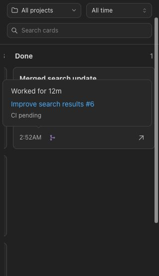
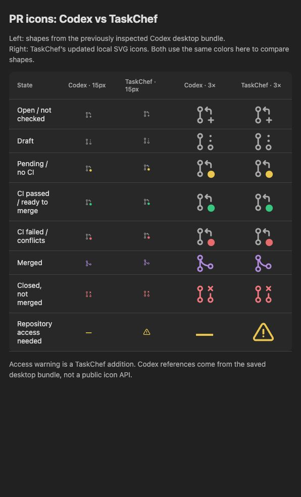

# GitHub PR status in TaskChef

TaskChef reads PR attachments from `state_5.sqlite:thread_attachments`.
Only records with `attachment_type = pull_request` count. The `payload.url`
identifies the PR. A transcript link alone does not establish PR ownership. The card uses only registered PRs referenced in the latest prompt/reply or successfully attached by a saved `codex_app.attach_artifact` call in that turn. Older chat attachments do not decide the latest turn's state.
Older Codex databases without this table show no PR attachments.

## Connect GitHub

1. In plugin settings, select **GitHub → Connect GitHub**, then **Sign in with GitHub**. The Done column also links to these connection controls when signed out.
2. Enter the displayed code on GitHub and approve access.
3. Install the GitHub App on the accounts and repositories you want to read.
   **Repository access** opens GitHub's installation settings.

TaskChef includes its registered GitHub App client ID. Once connected, the native settings action becomes **Manage GitHub**. Existing local client-ID overrides remain internal; the public settings page has no client-ID field. The device code, access token, and refresh
token stay in the local MCP server's system credential store. They never go to
the sidebar, ordinary JSON files, shell arguments, or a TaskChef hosted server.
On macOS this is Keychain; Windows uses Credential Manager; Linux requires
Secret Service. Release packaging includes credential-store bindings for macOS and Windows on
ARM64/x64, and Linux on ARM64/x64 with glibc or musl. There is no plaintext fallback. A locked or unavailable store
shows an error. GitHub's own approval and repository-selection pages control
access. Organizations may require administrator approval.

**Disconnect this computer** removes the local credential and clears the
process's PR cache. It does not revoke the GitHub grant. Revoke that separately
in GitHub's authorized-app settings if desired.

## Register the app

Register a GitHub App, enable **Device flow**, and keep expiring user access
tokens enabled. Disable webhooks. Request these repository permissions:

| Permission | Access | Purpose |
| --- | --- | --- |
| Pull requests | Read-only | Open, draft, closed, and merged PRs |
| Checks | Read-only | CI check results |
| Commit statuses | Read-only | Older CI status results |
| Metadata | Read-only | Required by GitHub |

Use the project repository as the homepage. Device flow needs no callback
server, private key, or client secret. GitHub requires the app to be installed
for private repository access. Choose **Any account** if distributing it to
other users. Registration does not itself give the app access to repositories.

The preview supports GitHub.com only. Enterprise hosts show an unavailable
status. Do not enter an OAuth App ID or a personal access token in the setting.

## Board rules

Archived chats go to the optional Archived column before these rules apply.
Chats with no saved turn are hidden. Running always takes priority over Done marks.

### With an active schedule

| Latest turn | Result | Column |
| --- | --- | --- |
| Either input source | In progress | Running |
| Either input source | Failed or interrupted | Waiting, with Interrupted tag |
| Scheduled prompt | Completed, with any PR state or no PR | Scheduled |
| Human prompt | Completed; all latest-turn PRs merged | Scheduled |
| Human prompt | Completed; unmerged/unknown PR or no PR | Waiting for input/review |

A saved heartbeat marker identifies a scheduled prompt. If input source cannot
be verified, use the human-input rules. Any active schedule keeps the chat
scheduled, even when the schedule that started the latest turn is now paused.
Manual Done is disabled until all schedules are paused.

### Without an active schedule

| Latest turn / user action | Column |
| --- | --- |
| In progress | Running |
| Marked Done for this turn, with no latest-turn PR | Done |
| Failed or interrupted, without a Done mark | Waiting, with Interrupted tag |
| Completed; all latest-turn PRs merged | Done |
| Completed; any unmerged or unknown latest-turn PR | Waiting for input/review |
| Completed; no latest-turn PR and no Done mark | Waiting for input/review |
| Unrecognized saved turn status | Unverified, within Waiting |

A new turn resets a manual Done mark. Passing CI does not guarantee merge
approval or that every branch-protection requirement is met. A closed PR
without merge remains Waiting for a human.

Cards show compact PR icons beside their time. Local SVG drawings match the
Codex branch layout: a curved merged branch, a plus on the plain open icon,
and colored status dots in place of the lower-right node. Cards and popup
rows use the same glyphs. The whole status line shares
one popup on hover or focus. It shows work duration, each linked PR title with
its number first, known CI status, and the next scheduled run, each on a separate
line with an icon. PR titles stay on one line and use an ellipsis. A final robot
row shows the chat’s direct subagent count across its history when greater than zero. Missing information is omitted. Mergeability and check time are not shown.
Unknown PR status uses a neutral icon without an Unavailable label on the card.
Repository access failures add a warning icon and a Grant access link to the
TaskChef GitHub App installation page. Confirmed permission errors say Access
denied; GitHub NOT_FOUND responses say Cannot access because they can also
mean the repository or PR was removed. Network and rate-limit errors do not
claim a permission failure. Valid PR state remains visible if CI access fails.
Tab moves from the status line to its PR link; Escape closes the popup.

## Codex sidebar icon research

OpenAI's changelog confirms draft, open, merged, and closed PR badges. It does
not publish a color legend. The table below comes from read-only inspection of
the installed desktop application's compiled `webview/assets/app-initial` bundle
on 10 October 2026. It is an implementation observation, not a documented API.

| Appearance | Installed Codex rule |
| --- | --- |
| Dashed PR icon | Draft |
| Purple merge icon | Merged |
| Red closed icon | Closed without merge |
| PR with red dot | Merge conflicts or failing CI |
| PR with green dot | Passing CI or `canMerge = true` |
| PR with yellow dot | Other open PR state (`in_progress`) |

The implementation selects `successful` when CI passes but `canMerge` is false,
and `ready` when `canMerge` is true. Both use the same green dot. Yellow does
not specifically mean no CI, and green alone does not prove merge readiness.
TaskChef reads PR state, title, draft state, head revision, merge conflicts,
merge state, and the latest commit's combined check status. It treats CLEAN or
HAS_HOOKS with MERGEABLE as ready to merge. The icon distinguishes Checks
passed from Ready to merge; the shared popup shows CI without mergeability. GitHub can report an unknown merge state briefly;
TaskChef checks that state again while the card is visible.

## Refresh and failure behavior

The board still polls its local MCP server every five seconds while visible.
GitHub checks use the board's project and time filters. The default time filter is
All time. Only rendered cards that intersect the visible viewport start requests.
Opening the board first reads local records without GitHub requests. Card visibility
then schedules a check after a 250 ms debounce. Scrolling, searching, filtering,
and loading more cards update this set. Offscreen cards do not start requests.
Opening one chat's Details checks that chat on demand. New chats follow the same
rule when their latest turn has an owned PR.

PR results are saved in `github-auth/pr-cache.json` beside TaskChef settings,
with restricted file permissions. This file contains no tokens. A shared local
lock protects reads and writes across MCP processes. Results are tied to the
GitHub account and client ID; disconnect and sign-in clear them.

Settled results have no short expiry. A new turn, a changed turn state, a new
PR, or manual Refresh triggers a board check. Details fetches only PRs with no saved result. Pending or unknown CI, an unknown
merge state on an open or draft PR, and failed checks of GitHub availability retry after 60 seconds
while the card is visible. Offscreen cards do not trigger these retries.
Passing or failed CI stays cached until another trigger. A merge made on GitHub
after a settled result is saved needs Refresh to be detected.

Queries combine up to 25 PRs per request. Hidden CLI/exec chats and archived
history do not start requests. Opening, reopening, and automatic Details polling do not force a check. Historical results have no expiry; explicit Refresh also updates the open detail’s PRs.
Rate limits still apply to explicit refreshes. A malformed or unwritable cache
reports an error instead of silently fetching the entire board.

Without GitHub sign-in, automatic Done from PR merge cannot be verified. Manual
Done for chats with no latest-turn PR still works. The Done column shows a
Connect GitHub link until sign-in succeeds.

GitHub receives repository names and PR numbers only, plus its authentication
token. Task titles, prompts, replies, and local paths are not included.

Unavailable status never counts as merged. A failed refresh replaces the cached
status with Unavailable. Codex database failures remain fatal to the board;
GitHub failures are shown in the connection dialog and PR badges.

Device sign-in polls only while its dialog is open and visible. It follows
GitHub's polling interval and slows down when requested. Pending sign-in is
stored in the credential store so another local MCP process can continue it.
Refresh tokens are rotated under a local lock shared by MCP processes.

## References

- [GitHub App device flow](https://docs.github.com/en/apps/creating-github-apps/authenticating-with-a-github-app/generating-a-user-access-token-for-a-github-app)
- [Refresh user tokens without a device-flow client secret](https://docs.github.com/en/apps/creating-github-apps/authenticating-with-a-github-app/refreshing-user-access-tokens)
- [GitHub App permissions](https://docs.github.com/en/rest/authentication/permissions-required-for-github-apps)

- [OpenAI changelog: PR status badges](https://learn.chatgpt.com/docs/changelog)

## Schedule clock

An active schedule appears as a clock before the PR icons, rather than text.
The shared status popup uses the desktop scheduler's `automations` table in
`sqlite/codex-dev.db`. When `next_run_at` is set, TaskChef shows
`next_run_nominal_at` if present, otherwise `next_run_at`. It uses the earliest
known time across active schedules for that chat. Reads are short and read-only.
Missing next-run metadata does not change the schedule flag or guess a time;
the popup omits the next-run line.

## Private repository CI reads

PR state and merge metadata use GraphQL. CI uses the head revision with the
REST check-runs and combined commit-status endpoints. These endpoints use the
app's existing read-only Checks and Commit statuses permissions. Reading a
GraphQL commit object can require Contents access on private repositories;
TaskChef does not request Contents access. A CI error keeps the independently
returned PR state. Empty legacy status lists do not count as pending CI.
If more than 100 latest check runs are returned, TaskChef keeps CI unknown
instead of claiming success from an incomplete page.
