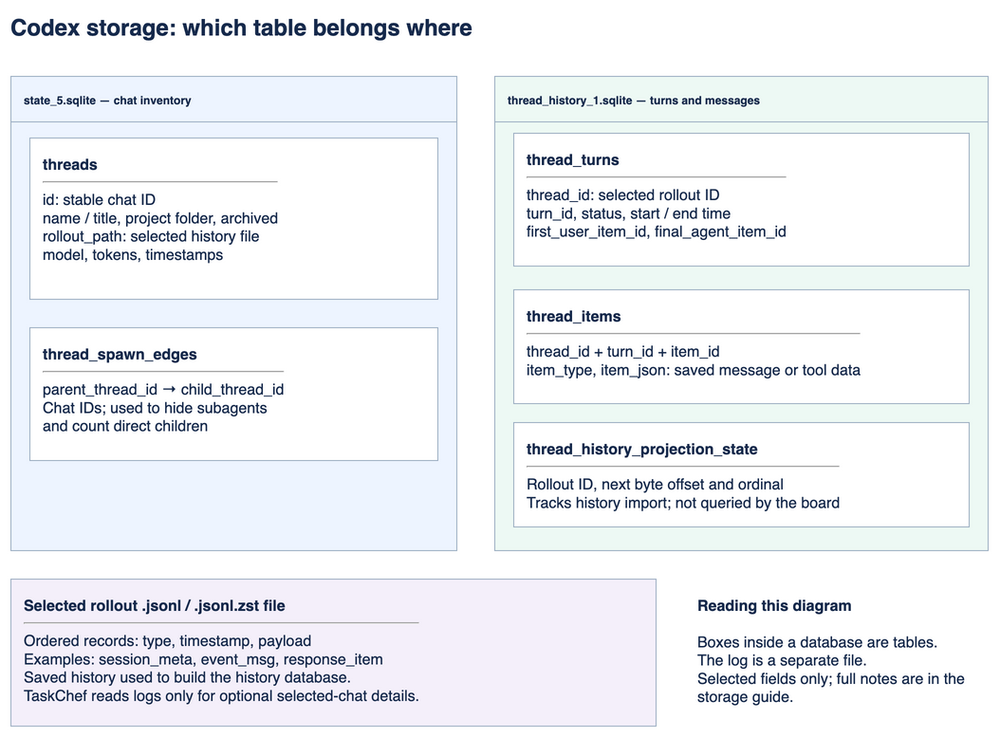
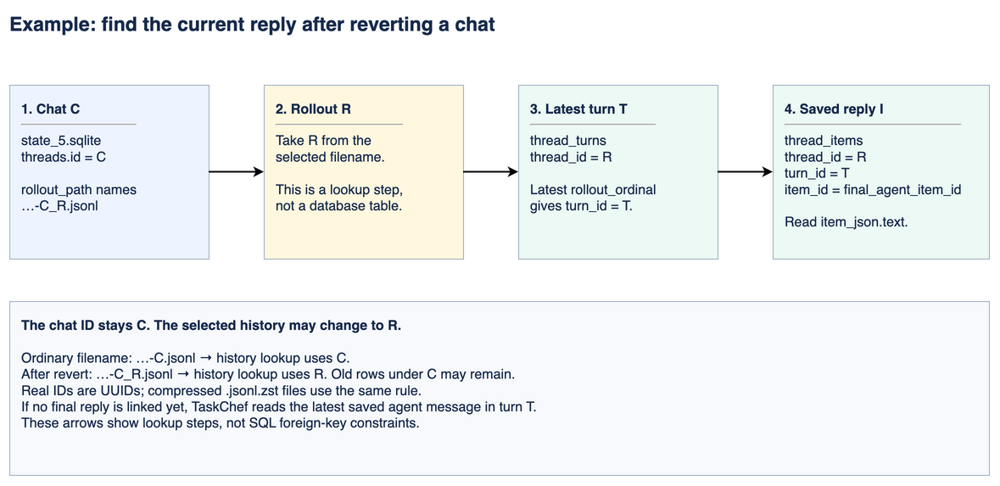

# TaskChef: Codex storage

[Edit the storage diagram](diagrams/taskchef-next-storage.drawio) · [Storage PNG](diagrams/taskchef-next-storage.drawio.png)

[Edit the reply lookup example](diagrams/taskchef-next-reply-lookup.drawio) · [Lookup PNG](diagrams/taskchef-next-reply-lookup.drawio.png)

The storage diagram groups tables inside their database files. The separate example below shows current-reply lookup. Selected fields only; these internal schemas can change.

## One chat, two possible IDs

Suppose chat **C** has a turn **T**:

| Store | Ordinary history | After Codex selects a new rollout R |
| --- | --- | --- |
| `state_5.sqlite` → `threads.id` | C | C: the chat ID stays the same |
| `threads.rollout_path` | `rollout-<timestamp>-C.jsonl` | `rollout-<timestamp>-C_R.jsonl` |
| `thread_history_1.sqlite` → `thread_turns.thread_id` | C | R: use the ID after the underscore |
| `thread_turns.turn_id` | T | The latest turn in R |
| `thread_items.thread_id` | C | R |
| JSONL → `session_meta.payload.id` | C | C: this is still the chat ID |

The filename examples use C and R as short labels. Real filenames contain UUIDs. `.jsonl.zst` uses the same ID rule. Codex's [rollout filename resolver](https://github.com/openai/codex/blob/main/codex-rs/rollout/src/metadata.rs) describes the separate ID after a revert. For paginated history, an unrecognized selected filename is an error. Legacy history supports noncanonical filenames with a stable chat-ID lookup. Old turn rows may remain under C. They belong to earlier history and must not replace the selected rollout's current turn.

TaskChef reads the filename from SQLite. It does not open the log to determine this lookup ID. Schedules, subagent links, navigation, and local Done marks continue to use the stable chat ID.

## Main tables and records

| File | Table or record | Example and use |
| --- | --- | --- |
| `state_5.sqlite` | `threads` | Chat C, name “Fix login”, project, archived flag, selected rollout path. Also holds model, reasoning effort, token total, pin and project metadata. |
| `state_5.sqlite` | `thread_spawn_edges` | Parent C → child D. Exclude D from the board; count it on C. |
| `thread_history_1.sqlite` | `thread_turns` | Rollout R, turn T, `status = completed`, duration and start/end times. This means the turn ended; the task may still need input or review. |
| `thread_history_1.sqlite` | `thread_items` | `(R, T, item I)` with `item_type = userMessage`, `agentMessage`, `commandExecution`, `mcpToolCall`, or `fileChange`. `item_json` contains the saved item body. The board reads the latest turn's first input to identify a heartbeat. It also reads the linked final reply, or the latest saved agent message in that turn when no final reply is linked. It never uses a previous turn as the current reply. Card excerpts contain at most 2,000 characters; the UI displays two lines. |
| `thread_history_1.sqlite` | `thread_history_projection_state` | R with the next byte offset and record ordinal. Tracks how far the saved history has been projected into SQLite. The board does not use it. |
| Rollout `.jsonl` | One JSON record per line | `type = session_meta`, `event_msg`, `response_item`, etc. The inner `payload.type` gives the event or response kind, such as `task_started` or `task_complete`. There are no SQL tables in this file. |

The optional log reader adds bounded message counts for one selected chat. It never supplies board status when SQLite fails.

## Other observed tables

The board does not query these tables. This list records table names seen during the local schema check; it is not a supported schema contract.

| Database | Other tables |
| --- | --- |
| `state_5.sqlite` | `_sqlx_migrations`, `thread_dynamic_tools`, `backfill_state`, `remote_control_enrollments`, `external_agent_config_imports`, `thread_sections`, `rollout_migration_state`, `rollout_migration_skipped_rollouts`, `projects`, `project_roots`, `project_idempotency_keys`, `thread_attachments` |
| `thread_history_1.sqlite` | `_sqlx_migrations`, `thread_realtime_items` |

TaskChef also reads heartbeat links from `automations/*/automation.toml`. Manual Done marks are saved in TaskChef's separate state file. Neither source modifies Codex's databases.

## Project picker sorting

The button beside Search projects cycles Most recent → A–Z → Z–A. Most recent is the default each time the view mounts. It uses the latest chat update time per project among chats allowed by the source and archive settings. Projects without matching chats follow those with activity, ordered by name. All projects stays first and No project stays last. Sorting preserves the search and selected project.

## Detail timing and PR cache

Details shows the latest turn’s duration and the sum of saved finished-turn
`duration_ms` values for the selected history ID. For a running turn, the UI adds
its elapsed time once. Idle time and child chats are excluded. The tooltip reports
finished turns whose duration is missing. Earlier rollout histories are not added;
after a rewind, this is recorded time for the selected history, not a lifetime total.
The aggregate is cached until either database changes.

Historical PR results use the existing disk cache. Opening Details fetches only
URLs with no saved result; it does not expire those results or invalidate them when
a different turn starts. Refresh explicitly checks the open detail’s PRs again.
The board still checks newly referenced PRs and retries pending or unknown current
PR states while their cards are visible. Disconnecting or changing the GitHub
account clears its cached results. Local history links are cached per database
snapshot and rebuilt when the database changes.

## Saved work time and usage in Details

Opening Details reads accounting events from the chat's saved rollouts and all
nested subagent chats found through `thread_spawn_edges`. Board inventory and
turn state still come from the databases. A database query failure remains fatal.
Optional accounting errors are shown as partial data.

The reader discovers older rollouts under `sessions` and `archived_sessions`.
It includes plain JSONL and zstd-compressed JSONL files. It checks this file
inventory at most once per minute while Details is used.
It caches compact accounting records in the MCP process. Unchanged files are
not read again. Appended files are read from the last complete line; replaced
or truncated files are read again. Changed compressed files are decoded again;
unchanged compressed files use the same cache. A runtime without zstd support
marks compressed histories partial. Concurrent views share this reader.

Work time sums finished turns across the parent's saved rollouts, deduplicated
by turn ID, and joins known durations from the selected SQLite history. It adds
current running time in the view. Idle time and subagent time are excluded.
Missing or unreadable histories make this total partial.

Usage reads `token_count` events. Chat totals use cumulative counter changes;
latest-turn usage uses individual call counters and the surrounding turn ID.
Copied events and repeated unchanged counters are counted once. A missing
boundary or counter correction does not prevent later turns from reporting.
Subagent usage is included once per descendant chat. `root_turn_id` assigns
child calls to the latest parent turn. Missing parent links leave that turn
partial. Deleted logs, missing calls, and counter resets can prevent an exact
historical result; the UI never claims that the displayed subtotal is a bill.

Cost uses each saved call's model and input/cache-read/cache-write/output
counts. Reasoning tokens are already included in output tokens. Unknown models
remain unpriced. Missing calls can leave tokens known but cost partial. A
partial priced subtotal is shown as “At least”.

The package ships a dated table of standard USD API prices from
<https://developers.openai.com/api/docs/pricing>. While Details is used, the
server checks the public Markdown version in the background at most weekly.
A failed update is retried after an hour. The last valid update is saved beside
TaskChef's own Done state; the bundled table works offline. No API key, chat
content, or GitHub token is sent for this public request. If the published table
format changes, the last valid prices remain in use.

Estimates apply current standard API prices, including the published long
context rates above 272K input tokens. They do not reproduce subscription
charges, historic prices, fast-mode surcharges, regional fees, or tool fees.
