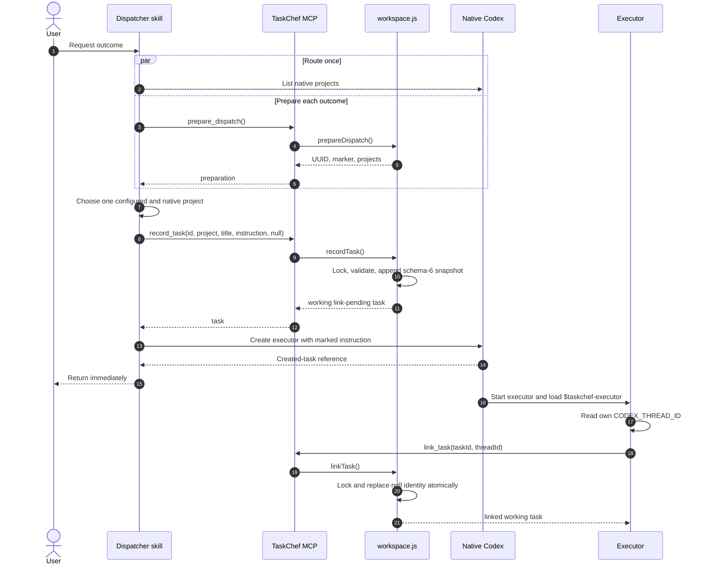
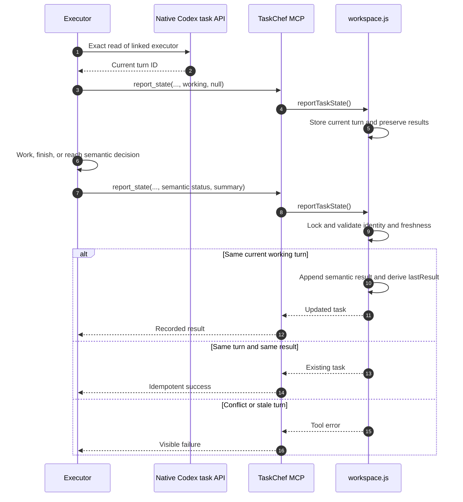
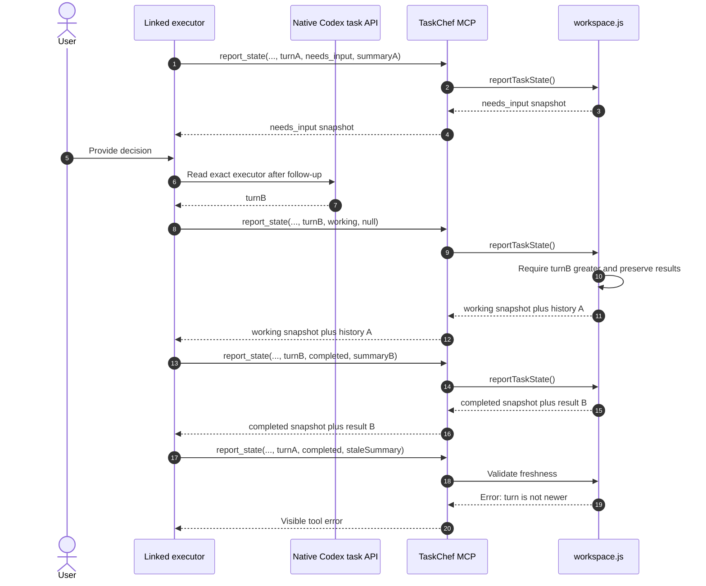
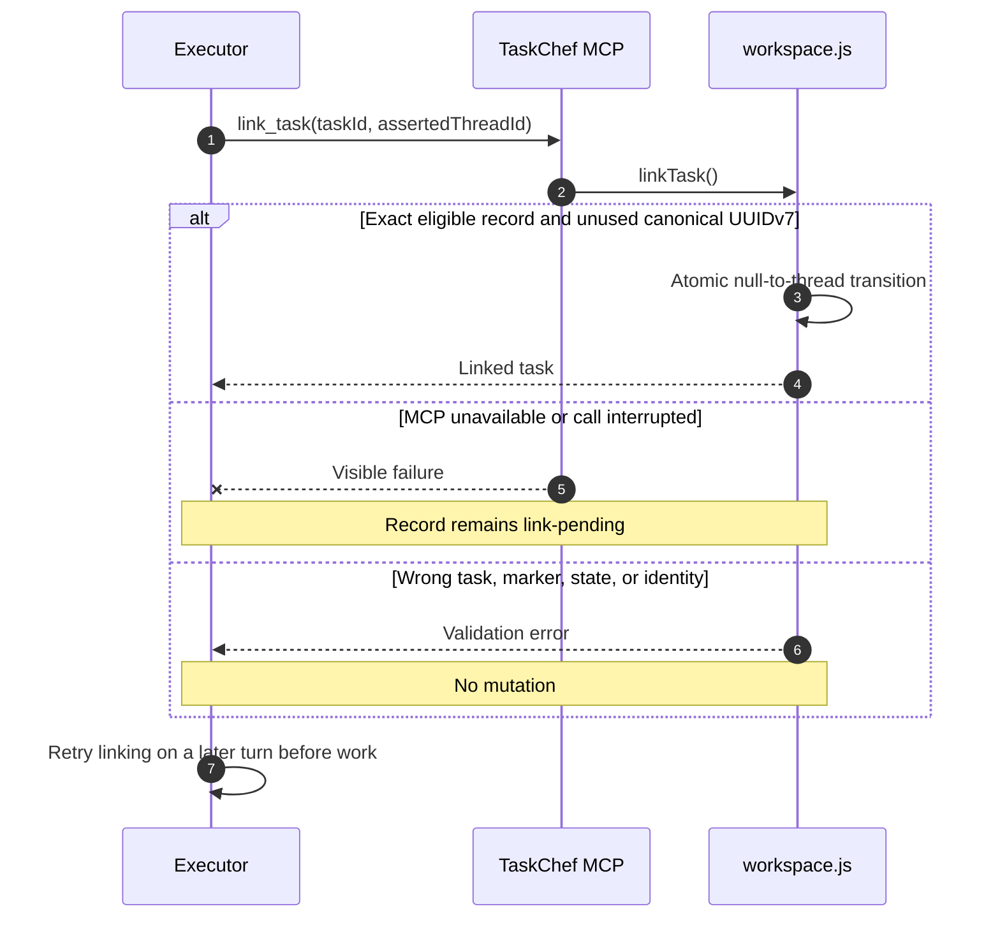
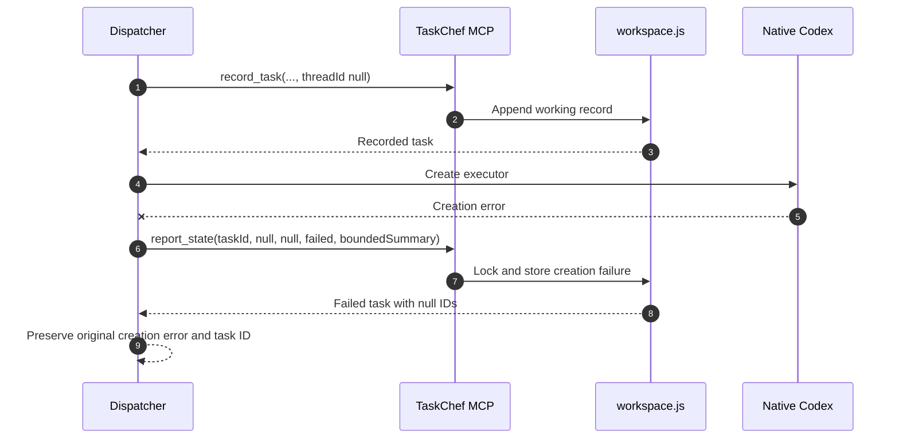
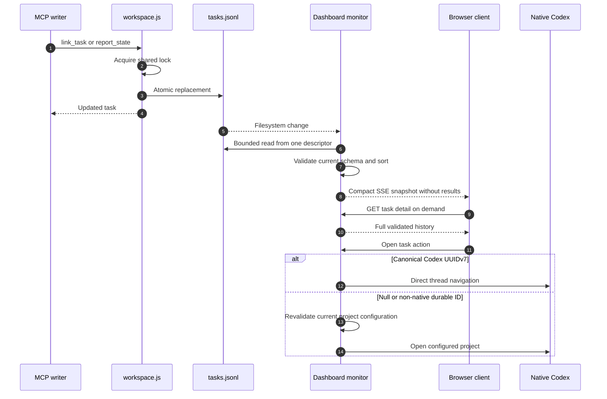

# TaskChef workflows

This developer and advanced-agent guide explains how the current implementation
moves data through TaskChef. The [specification](spec.md) is normative; the
[README](../README.md) owns user operation. The
[FirstMate comparison](firstmate-taskchef-comparison.md) is non-normative
research.

## Implementation map

| Surface | Responsibility |
| --- | --- |
| `skills/taskchef-delegate/SKILL.md` | Split, route, record-before-create, create, return. |
| `skills/taskchef-executor/SKILL.md` | Own, self-link, execute, and report every executor turn. |
| `skills/taskchef-bootstrap/SKILL.md` | Initialize current workspace and configure projects. |
| `skills/taskchef-report/SKILL.md` | Select cached tasks and perform bounded live checks. |
| `src/mcp.js` | Four primary lifecycle tools, one deprecated alias, and MCP annotations. |
| `src/delegation.js` | UUID marker, concise executor-skill invocation shape, and creation-failure handling. |
| `src/workspace.js` | Current schemas, validation, locking, atomic JSONL writes, linking, and result freshness. |
| `src/cli.js` | Administration, inspection, diagnostics, and dashboard startup. |
| `src/dashboard.js` | Validated compact snapshots, SSE fan-out, on-demand details, and bounded open actions. |

The MCP process resolves `TASKCHEF_WORKSPACE` once and never accepts a model
supplied path. The CLI resolves `--workspace`, then the environment, then the
per-user default.

## Normal delegation and self-linking

The dispatcher uses native Codex project discovery for routing and MCP for
TaskChef state. It never supplies executor identity.

Record-before-create makes native creation failure observable. Executor
self-linking removes dispatcher-side polling, task search, title matching, and
parent/child identity inference.

The generated task begins with the complete assignment, then places its marker
immediately before one explicit `$taskchef-executor` invocation. Older
recorded tasks with first-line HTML or heading markers and former inline
protocol remain readable; the deprecated `report_result` alias preserves their
semantic callbacks.

## State reporting

The executor obtains the turn identity from an exact native read of its own
linked task. `report_state` records live turn state while preserving the ordered
semantic result history.

A native approval prompt is not a semantic result. `needs_input` is reserved
for a user decision or fact required to proceed.

## Follow-up turns

Turn IDs are freshness tokens for semantic callbacks. Lexical UUIDv7 order lets
the workspace reject a callback from an older executor turn.

The executor contract therefore requires a new exact read on every follow-up;
cached or inherited turn IDs are invalid.

## Link-pending and failure paths

A failed or interrupted link never authorizes substantive work. The record
remains a visible retry point for the same executor.

If `CODEX_THREAD_ID` is missing, the executor reports the problem visibly and
does not substitute `CODEX_SESSION_ID`, a parent ID, or search results.

Native creation can fail after the durable record exists:

The summary is bounded and excludes secrets, transcripts, and raw command
output. A creation-failure record cannot later be linked.

## Dashboard update flow

Every mutation rewrites `tasks.jsonl` atomically under the workspace lock.
The monitor tolerates replacement races, validates a complete snapshot, and
publishes only the newest state to each SSE client.

The dashboard binds to `127.0.0.1`, has no shared session state, limits task
count, file size, result count, and display fields, and checks origin/authority
for stateful local actions. The monitor already validates the complete log, but
snapshot/SSE list projections omit `results` so repeated updates do not resend
unnecessary history. A read-only per-task endpoint returns full history only
when the dialog opens. Historical project paths are untrusted until matched
against current configuration.

## Schema 4/5 migration

`taskchef workspace migrate` acquires the same workspace lock as lifecycle
writers, validates the complete legacy log, converts each schema-4/5 latest
result into zero or one initial schema-6 `results` entry, then validates the
complete candidate. Before replacement it writes and reads back an exclusive
`tasks.jsonl.pre-v6-*.bak` file. The task log is replaced atomically and
validated again. A second run sees only schema 6 and returns unchanged without
another backup. Unsupported or malformed input fails before backup/rewrite;
after a later filesystem failure, the reported backup is the recovery source.

## Concurrency and trust boundaries

Configuration and task mutations use the same `proper-lockfile` lock. ID and
identity uniqueness checks, link eligibility, and result freshness occur
inside the critical section. Writes use temporary files/hard links and atomic
rename so readers see complete snapshots.

The dispatcher controls routing and immutable intent. The executor controls its
cooperatively asserted identity and semantic result. Neither identity nor
summary is cryptographically authenticated; this is a local single-user trust
model. Managed files, instructions, project snapshots, MCP inputs, and dashboard
requests are validated at every action boundary.

Configuration schema 2 and task schemas 4, 5, and 6 are accepted. Schemas 4/5
are read/migration compatibility until an explicit migration or lifecycle
mutation upgrades each record to schema 6. Schema 6 persists `results` only and
derives `lastResult` for compatibility. Other schemas are rejected without rewrite.
