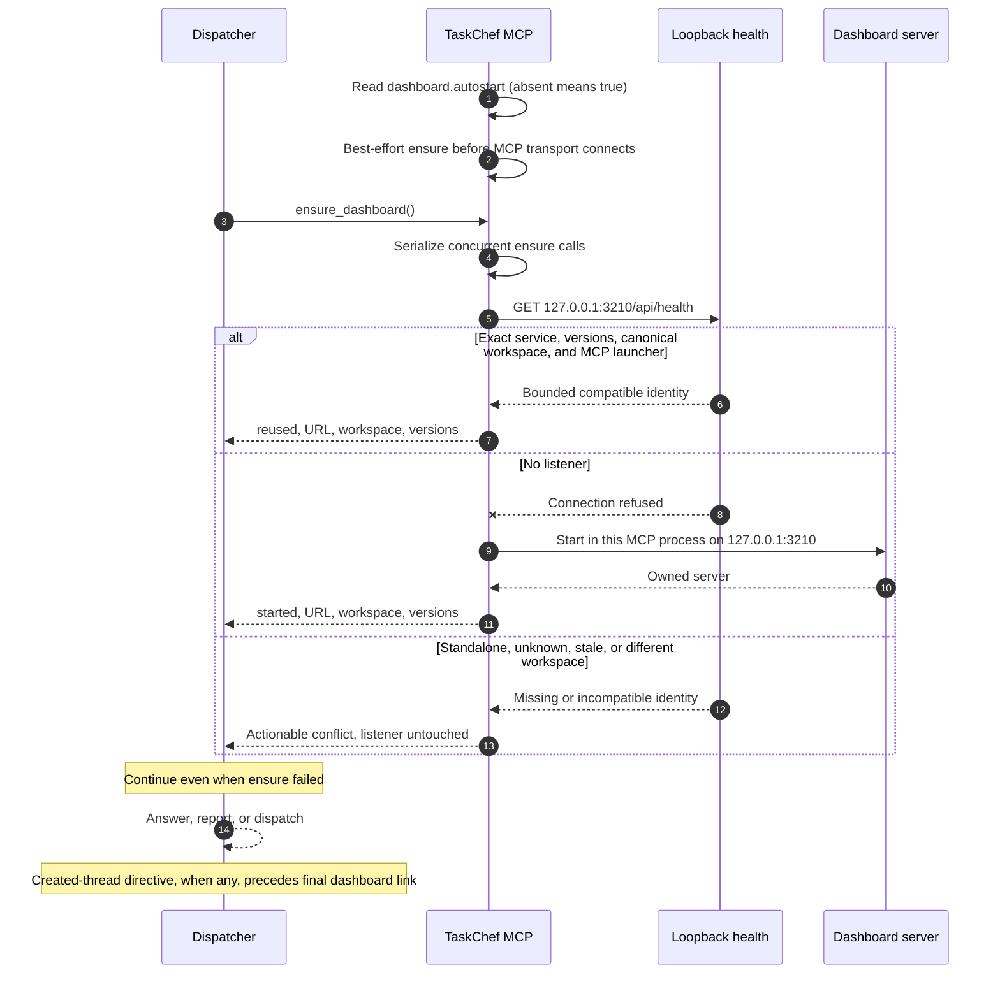
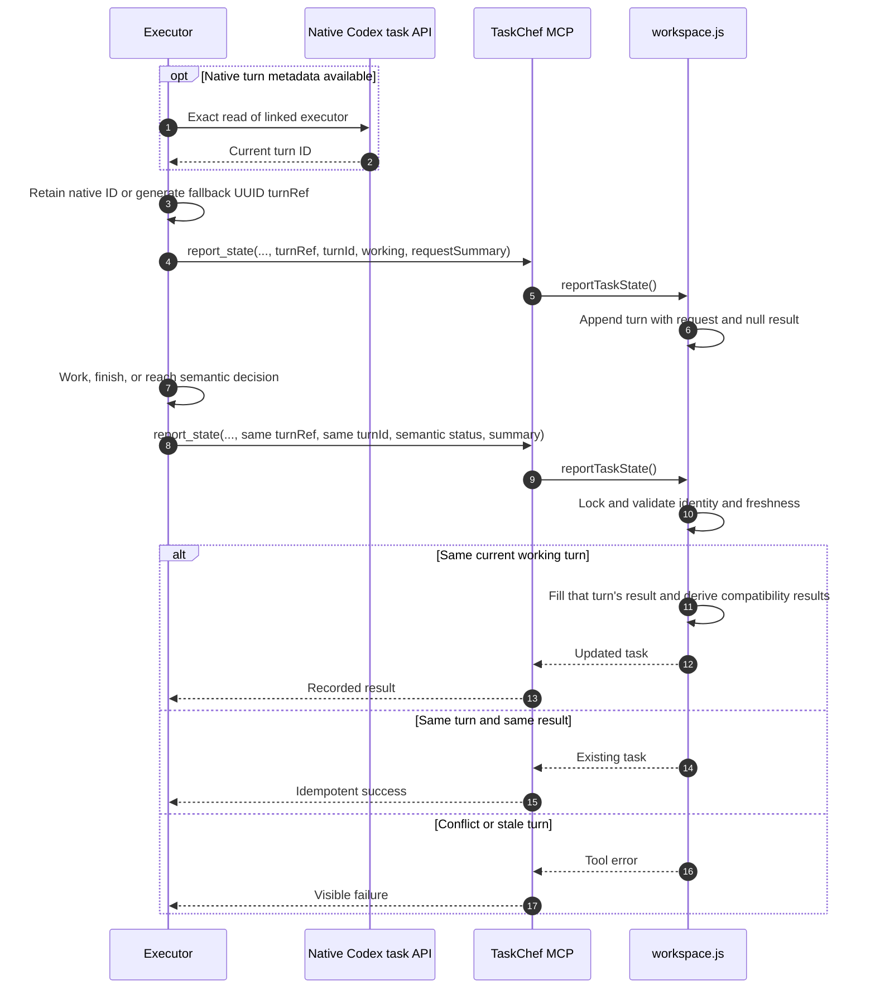
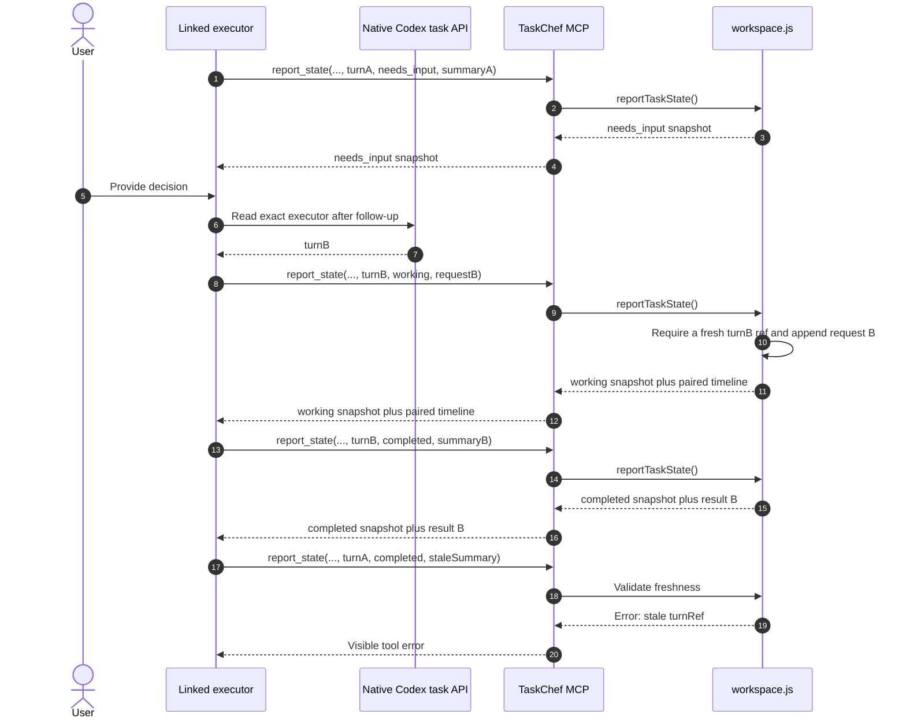
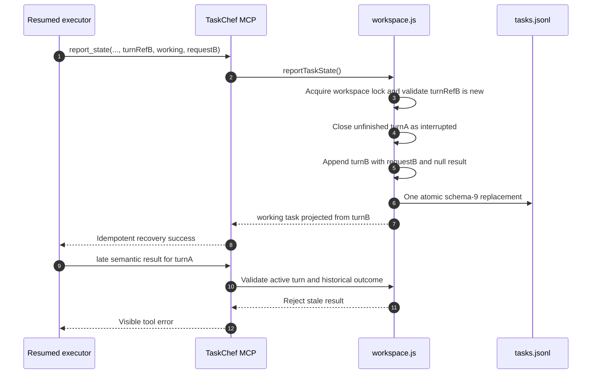
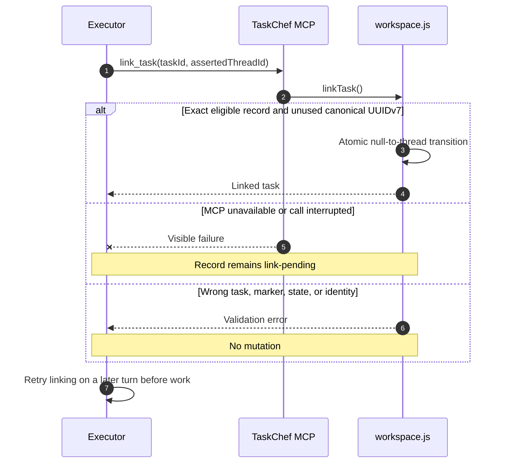
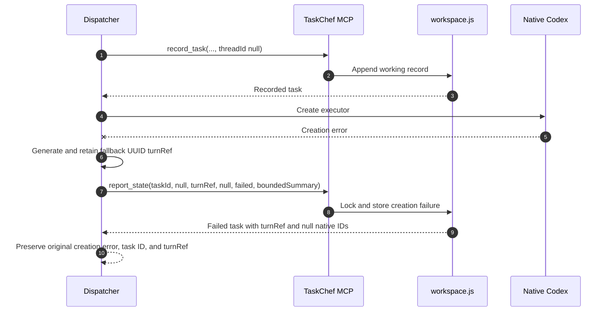
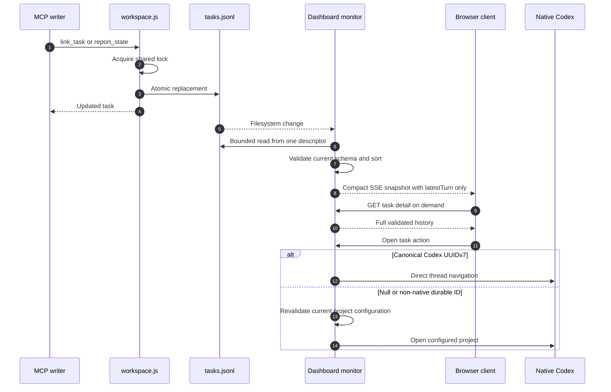

# TaskChef workflows

This developer and advanced-agent guide explains how the current implementation
moves data through TaskChef. The [specification](spec.md) is normative; the
[README](../README.md) owns user operation. The
[FirstMate comparison](firstmate-taskchef-comparison.md) is non-normative
research.

## Implementation map

| Surface | Responsibility |
| --- | --- |
| `skills/taskchef-delegate/SKILL.md` | Split, route, record-before-create, create, return. |
| `skills/taskchef-executor/SKILL.md` | Own, self-link, execute, and report every executor turn. |
| `skills/taskchef-bootstrap/SKILL.md` | Initialize the workspace and maintain the Codex project index. |
| `skills/taskchef-dashboard/SKILL.md` | Ensure or recover the canonical dashboard and return its URL. |
| `skills/taskchef-copilot/SKILL.md` | Explain normalized cached briefs and coordinate safe next actions. |
| `src/mcp.js` | Dashboard ensure, four primary lifecycle tools, one deprecated alias, shutdown ownership, and MCP annotations. |
| `src/delegation.js` | UUID marker, concise executor-skill invocation shape, and creation-failure handling. |
| `src/workspace.js` | Current schemas, validation, locking, atomic JSONL writes, linking, and result freshness. |
| `src/cli.js` | Administration, normalized cached briefs, inspection, diagnostics, and dashboard startup. |
| `src/dashboard.js` | Versioned health identity, validated compact snapshots, SSE fan-out, on-demand details, and bounded open actions. |
| `src/dashboard-manager.js` | Concurrent singleton ensure, exact listener reuse, conflicts, and owned shutdown. |
| `src/usage.js` | Optional bounded ccusage execution, exact primary-thread mapping, normalized aggregation, and the private usage cache. |
| `src/usage-tracker.js` | Deferred sampling, cumulative boundaries, historical availability, and per-turn deltas. |

The MCP process resolves `TASKCHEF_WORKSPACE` once and never accepts a model
supplied path. The CLI resolves `--workspace`, then the environment, then the
per-user default.

## Dispatcher dashboard lifecycle

MCP activation makes dashboard maintenance a best-effort lifecycle action. The
generated managed `AGENTS.md` block also retries it before dispatcher turns and
keeps response ordering centralized instead of duplicating it across skills.

When the MCP transport or plugin process closes, it closes only the server it
started. A foreground `taskchef dashboard` listener identifies itself as
standalone and is never reused as the canonical MCP dashboard, because its
archive child process may inherit a different host environment. No TaskChef
path terminates an incompatible listener or installs OS persistence.

Autostart and explicit ensures share the same manager promise, so concurrent
initialization and recovery calls produce at most one owned listener. An
explicit `dashboard.autostart: false` skips only activation-time ensure. Any
failure is reduced to a fixed stderr diagnostic; tool registration and MCP
availability continue. Activation never opens a browser.

## Release-install verification

The practical release handoff ends in this order:

1. Install the released plugin.
2. Activate or reload its new TaskChef MCP process.
3. Run `$taskchef-dashboard` or call `ensure_dashboard`.
4. Verify the expected TaskChef version, protocol `serverVersion`, `mcp`
   launcher, canonical workspace, and canonical URL returned by the dashboard identity.

Replacing plugin files alone cannot execute autostart because old code remains
in the already-running MCP process. Installation does not necessarily reload
Codex. An exact-compatible MCP dashboard may be reused; a standalone or unknown
listener is never terminated or replaced.

## Normal delegation and self-linking

The dispatcher uses native Codex project discovery for routing and MCP for
TaskChef state. It never supplies executor identity.

Record-before-create makes native creation failure observable. Executor
self-linking removes dispatcher-side polling, task search, title matching, and
parent/child identity inference.

The generated task begins with the complete assignment, leaves one blank line,
then places one explicit `$taskchef-executor` invocation immediately before its
final marker. Older
recorded tasks with first-line HTML or heading markers and former inline
protocol remain readable; the deprecated `report_result` alias preserves their
semantic callbacks.

## State reporting

The executor always establishes a `turnRef` before work. An exact native read
supplies the same value as optional `turnId` metadata when available; otherwise
the executor retains a fresh UUID and reports `turnId: null`. `report_state`
records live turn state as a paired request/result timeline.

That timeline is also the durable GitHub-link source. A working request names a
known selected repository with its canonical GitHub URL. A terminal result
keeps full issue and pull-request URLs, including separate child-repository and
workspace/root pull requests. The dashboard does not recover omitted links by
scanning the native Codex transcript, and the executor does not guess an
ambiguous repository.

A native approval prompt is not a semantic result. `needs_input` is reserved
for a user decision or fact required to proceed.

Ordinary completion returns after the terminal callback; it does not archive,
hand off, close, navigate away from, or otherwise terminate the native Codex
task. An archive requires an explicit request in the current assignment or
follow-up for that exact task. `finish`, `complete`, `done`, `ship`, and cleanup
alone do not authorize it. Any explicitly requested action that could make the
executor unavailable must follow, never precede, an accepted terminal callback.
If reporting fails, the later action is forbidden and the executor remains
accessible. If the later action fails, its error does not reopen or replace the
accepted semantic state.

## Follow-up turns

Turn refs are freshness tokens for semantic callbacks. The workspace rejects a
callback whose ref belongs to a historical turn. Fallback UUID refs are opaque
and unordered; native-backed UUIDv7 refs retain native ordering so a delayed,
previously unseen older start cannot replace newer native state.

The executor contract therefore requires a new `turnRef` on every follow-up.
Native turn reads are preferred metadata but optional; cached or inherited IDs
and replacement fallback UUIDs for the same prompt are invalid.

## Interrupted-turn recovery

A crash, MCP failure, app restart, or upgrade can leave the latest turn with a
null result. A newer valid `working` report is the durable recovery signal. The
workspace handles it inside the same lock and atomic replacement as every
other lifecycle mutation:

The interrupted outcome uses only the fixed TaskChef-authored summary. It is
visible in CLI and detail timelines but excluded from semantic `results` and
`lastResult`. Compact dashboard cards therefore show request B with “In
progress.” Notification reconciliation observes one new working event and does
not manufacture a failed-result event. Exact retries of either working start
return the current snapshot without reopening or duplicating a turn. Concurrent
newer starts serialize under the lock, leaving one ordered timeline whose only
unfinished entry is the latest turn.

## Link-pending and failure paths

A failed or interrupted link never authorizes substantive work. The record
remains a visible retry point for the same executor.

If `CODEX_THREAD_ID` is missing, the executor reports the problem visibly and
does not substitute `CODEX_SESSION_ID`, a parent ID, or search results.

Native creation can fail after the durable record exists:

The summary is bounded and excludes secrets, transcripts, and raw command
output. A creation-failure record cannot later be linked.

## Dashboard update flow

Every mutation rewrites `tasks.jsonl` atomically under the workspace lock.
The monitor tolerates replacement races, validates a complete snapshot, and
publishes only the newest state to each SSE client.

The dashboard binds to `127.0.0.1`, has no shared session state, limits task
count, file size, result count, and display fields, and checks origin/authority
for stateful local actions. Its bounded identity endpoint contains no task data
or secrets. The monitor already validates the complete log, but
snapshot/SSE list projections omit `turns` and derived `results` so repeated
updates do not resend unnecessary history. A read-only per-task endpoint returns the full timeline only
when the dialog opens. Historical project paths are untrusted until matched
against current configuration.

The browser derives one immutable Updates-panel snapshot when it first observes
a semantic lifecycle transition. The snapshot keeps its event-time title,
state/event, turn ref, optional Codex turn ID, timestamp, and relevant summary.
Its identity combines task ID, turn ref, and event, with creation time as the fallback when creation
has no turn. A separate seen-identity set outlives the bounded visible notices,
individual dismissals, and Clear all, preventing replay after reconnect,
normalization, or disappearance and reappearance. Per-task semantic signatures
also remain as tombstones while a task is absent. When one compact snapshot
first reveals a latest semantic result plus a newer working turn, the browser
captures both. The first page snapshot is a quiet baseline so opening or
refreshing the dashboard does not replay existing history. If a task is first
observed in a progressed state after that baseline, creation is retained
alongside the observable result and working events. The current task list is
used only as the navigation target: if the task is gone, the notice stays
readable and selection reports that current details are unavailable.

The retained toast list is not live. Reconciliation passes only its newly added
snapshots to a separate polite status region, so reconnect, dismissal, Clear
all, and ordinary rerendering do not re-announce retained history. Toast action
labels remain concise while `aria-describedby` connects the visible summary,
event time, and missing-task explanation for assistive technology.

## Schema 4-8 migration

`taskchef workspace migrate` acquires the same workspace lock as lifecycle
writers, validates the complete legacy log, converts schema-4/5/6 results into
request-unknown completed turns and preserves a newer working turn, then validates the
complete candidate. Before replacement it writes and reads back an exclusive
`tasks.jsonl.pre-v9-*.bak` file. Schema-7/8 timelines gain a durable `turnRef`:
non-null `turnId` values are copied exactly and null IDs receive persisted UUIDs.
Task and turn counts plus all refs are validated before and after the atomic
replacement. A second run sees only schema 9 and returns unchanged without
another backup. Unsupported or malformed input fails before backup/rewrite;
after a later filesystem failure, the reported backup is the recovery source.

## Concurrency and trust boundaries

Configuration and task mutations use the same `proper-lockfile` lock. ID and
identity uniqueness checks, link eligibility, and result freshness occur
inside the critical section. Writes use temporary files/hard links and atomic
rename so readers see complete snapshots.

The dispatcher controls routing and immutable intent. The executor controls its
cooperatively asserted identity and semantic result. Neither identity nor
summary is cryptographically authenticated; this is a local single-user trust
model. Managed files, instructions, project snapshots, MCP inputs, and dashboard
requests are validated at every action boundary.

Configuration schema 2 and task schemas 4 through 9 are accepted. Schemas
4-8 are read/migration compatibility until an explicit migration or lifecycle
mutation upgrades each record to schema 9. Schema 9 persists `turns`, including
timeline-only interrupted outcomes, and derives semantic-only `results` and
`lastResult` plus `latestTurn` for compact compatibility. Other schemas
are rejected without rewrite.
